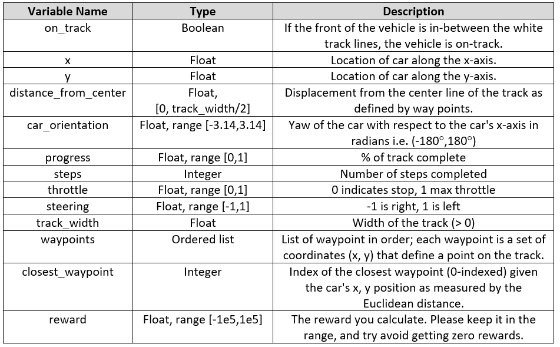
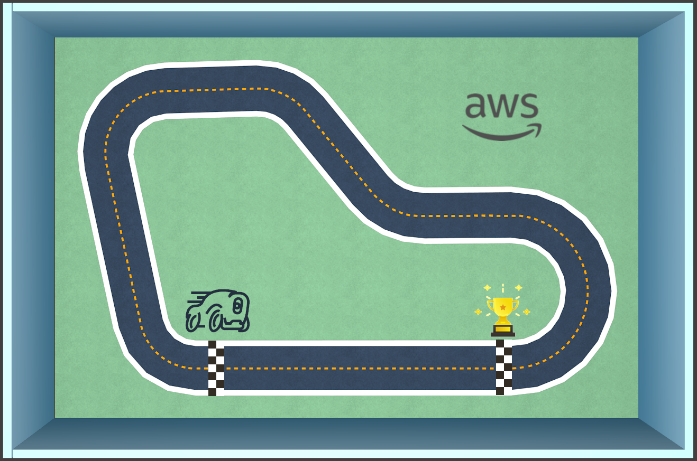

# Lab 1: Reward Function Constructors Championship!

## Overview

In this lab we will provide an overview of the AWS DeepRacer simulator found in the AWS Console. You will also get hands-on with the reward functions we use in AWS DeepRacer.
You will form a team with fellow attendees at your table to take part in the **Reward Function Constructors Championship**.

## Step 1: AWS Console
Logon to the AWS Console using the account details provided to you.
Navigate to AWS DeepRacer, https://aws.amazon.com/deepracer.
From the AWS DeepRacer landing page, expand the pane on the left and select **Reinforcement learning.**

## Step 2: Model List Page
This page gives a list of all the models you have created and each model's respective status.


If you don't have any models this list will be empty, and you can create a model by choosing **Create model**.
Once you have created models you can use this page to view the status of the model, for example is it training, or ready to download or evaluate. You can click on the model's name to proceed to the Model details page. Alternatively selecting the radio button next to a model name will allow you to delete the model, clone the model, or download the model, if training has completed.

Choose **Create model**


## Step 3: Create model
This page gives you the ability to create an RL model for AWS DeepRacer and start training. There are a few sections on the page, so let's look at each in detail.

#### Model details
Here you have the ability to name your model, provide a model description, and create the resources needed to start AWS DeepRacer training jobs. Note that the resources should be ready in the account given to you. If you do not see three green radio boxes beneath the Permission and storage section please let us know.


<font color=cyan>**Info**</font> **Buttons**
Throughout the console you will see <font color=cyan>**Info**</font> buttons. When selected they will slide out an information pane from the right of the window, without navigating away from the page.


Please enter a name for your model and scroll to the next section

#### Environment simulation
Here you will select the track on which your RL model will train. This track will be simulated by AWS RoboMaker throughout the training process, and you will be able to monitor training progress. We will cover that in a few steps.

At present we have only loaded one track into AWS DeepRacer. The track has the same shape that you will encounter at our AWS DeepRacer activities throughout re:Invent. We will have a detailed slide at the end of the workshop outlining the activities.

Choose the re:Invent 2018 track and scroll to the next section.

#### Reward function
In RL, the reward function plays a **critical** role in training an RL model. The reward function directly impacts the behaviors that your model will learn, by determining which actions (from each specific state) lead to good outcomes and which actions lead to outcomes that should best be avoided. The reward function contains the “logic” to determine if an action was good or bad, and quantify it. For example, if your goal is for the car to finish a lap around a racetrack, rewarding the car for staying on the track, as opposed to going off the track, is a good starting point. An example of the logic used in a basic reward function that incentivizes the car for staying closer to the middle of the track can be seen in the Basic Reward function section.

On the left-hand-side of the page, please expand the **Basic function** and choose **Insert code**. This action will copy the basic reward function code to the code editor on the right. **Note** that the code in the code editor on the right will be the reward function that is used to train your model.


The reward function in the code editor contains the following logic.
```
    marker_1 = 0.1 * track_width
    marker_2 = 0.25 * track_width
    marker_3 = 0.5 * track_width

    reward = 1e-3
    if distance_from_center >= 0.0 and distance_from_center <= marker_1:
        reward = 1
    elif distance_from_center <= marker_2:
        reward = 0.5
    elif distance_from_center <= marker_3:
        reward = 0.1
    else:
        reward = 1e-3  # likely crashed/ close to off track
        
```
Here we first create three bands around the track, using the three markers, and then proceed to reward the car more for driving in the narrow band as opposed to the medium or the wide band. Also note the differences in the size of the reward. We provide a reward of 1 for staying in the narrow band, 0.5 for staying in the medium band, and 0.1 for staying in the wide band. If we decrease the reward for the narrow band, or increase the reward for the medium band, we are essentially incentivizing the car to be use a larger portion of the track surface. This could come in handy, especially when there are sharp corners.

Here is a list of variables that you can use to build the logic for your reward function. Note that the reward function has to be written using Python syntax, and we've added a **Validate** button to help you check that your code is good before training begins. 



Please scroll to the next section, we will return to the reward function shortly.

#### Algorithm settings
This section controls the hyperparameters for your RL optimization algorithm. Please expand it. These hyperparameters have been optimized by our scientists, through lots of testing. That said you are more than welcome to change them. 

Training happens through an iterative process of simulation to gather experience, followed by training on the experience to update your model, followed by simulation using the new model to get new experience, followed by training on the new experience to update your model and so forth. Initially your model does not have any knowledge of which actions will lead to good outcomes. It will choose actions at random as it explores the environment. Over time it will learn which actions are better and start to exploit these. How quickly it exploits or how long it explores is a trade-off that you have to make.


Please scroll to the next section.
**Don't start training yet please**

#### Stop conditions
This is the last section before you start training. Here you can specify the maximum time your model will train for. Ideally you should put a number in this condition. You can always stop training early. Furthermore, if your mode stopped as a result of the condition, you can go to the model list screen, and clone your model to restart training using new parameters.

**Don't start training yet please**


## Step 4: Reward Function Constructors' Championship
We are now going to start the Reward Function Constructors' Championship, a short exercise to help build your reward function intuition. The challenge is to build a reward function that can can teach your car to drive from the starting point to the start of the hairpin. Instructions follow below the image. The team whose car reaches the hairpin first, and has a screenshot of the simulator as proof, wins (just shout out when you get there!). 



#### Instructions 
Form a team with the other attendees at your table. For the challenge you will have 10 minutes to come up with a reward function and 5 minutes to implement it and start training.

Tip: scroll up to the reward function section and look at the advanced reward function examples. What behavior do you want to incentivize to ensure your car stays on track and completes the largest part of the track? You will have to write your reward function using Python in the reward function section, and validate that it works, before you can start training.

At the end of your 10 minutes nominate a team member to implement and start training. You can specify a max. time stopping condition of 45 minutes before you start training. We will not need the full 45 minutes, and furthermore once a winner has been announced you can stop training. In 15 minutes times we will continue with the lab and workshop content, and thus would prefer if only one person is slightly distracted. Before you start training, please also note that it would be best to decrease the number of episodes between training to 5, and also decrease the number of epochs to 3. The last two changes will help your model get more training iterations during the time, which should be good for a straight track model. If you can find a reward function sooner, you can always start training sooner, and just terminate later.

Let's get going!

## Step 5: Model Training
Training can take up to 6 minutes to initialize. We will cover the orchestration that happens after the first lab. 
Once your model has started training you should see the following on the Model details page, which can be found when you select your model from the Model list page.


The graph on the left is the TrainingRewardScore graph showing the cumulative reward your car receives for each episode. An episode is the number of steps from the car’s starting point and the next termination state (completing the track or going off track). As your model trains you should see the reward line increase, however expect it to fluctuate initially. Once the cumulative reward does not improve much for each subsequent episode it is an indication that the model is not learning anything new and has converged. 

You can also visually inspect driving behavior by looking at the video stream from the simulator. You may notice that your car resets once it drives off the track. This is normal as the car is considered in a terminal state, and resetting it will restart a new episode. Furthermore, the car will reset at subsequent waypoints each time. This is done to help the car better explore the environment. Once you see your car successfully complete subsequent laps on the track, check to see if the reward graph is flattening out. This is a good indicator for you to stop training your model. In the event that your car is not completing the track and your model stops improving, as judged by the reward graph, consider stopping the training and proceed to tweak your model. 

You can also inspect the Amazon SageMaker and AWS RoboMaker logs saved in Amazon CloudWatch. To access the logs you can select the 3 dots in the top right of your TrainingRewardScore graph, and select view logs or view in metrics. View logs will show you logs of the output from the Amazon SageMaker and AWS RoboMaker containers. They will contain more detailed information about your training job. 


Logs are stored in Amazon CloudWatch


Amazon SageMaker Log recorded during RL Training


## Step 6: Model Evaluation
Once your model has finished training, you will evaluate it in the simulator. This can be done from the model details page and choosing **Start evaluation** from the Evaluation section on the model details page. Here you can select the track on which you will evaluate your model, and also how many laps you want to evaluate it for. 
During evaluation your trained model will be used in the simulator to determine your lap time and lap progress.


