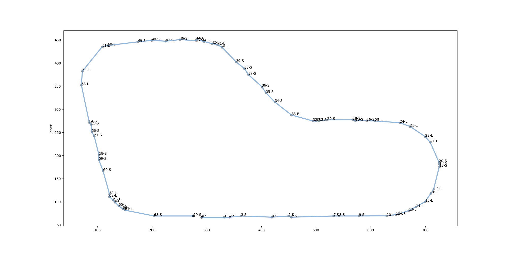
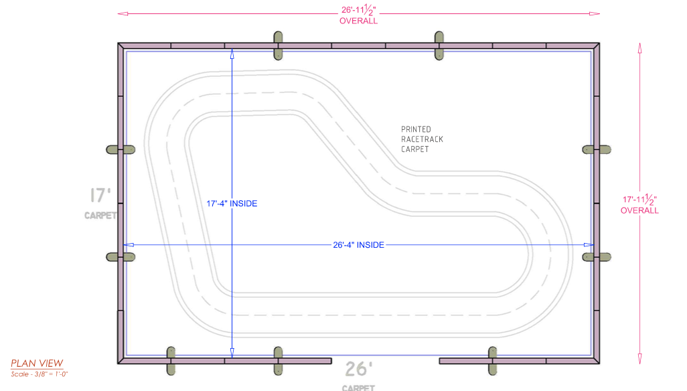

## AWS Deepracer Workshop
A hands-on workshop to introduce developers to AWS DeepRacer at re:Invent 2018.

[Lab 1: 30 minutes](https://github.com/aws-samples/aws-deepracer-workshops/tree/master/Lab%201)

[Lab 2: 22 minutes](https://github.com/aws-samples/aws-deepracer-workshops/tree/master/Lab%202)

## Job Analysis and Visualization
[Visualization Notebook](https://github.com/aws-samples/aws-deepracer-workshops/blob/master/utils/DeepRacer%20Log%20Analysis.ipynb)

## Waypoints for re:Invent track
The waypoints are like GPS location indicators for the car. The nearest waypoint can be found using the euclidean distance, but we have made this available in the reward function to make it easy. The labels (L = Left, R = Right,S = Straight) indicate the best action to take at those waypoints.

## Reinvent Track with Dimensions

## License Summary

This sample code is made available under a modified MIT license. See the LICENSE file.
