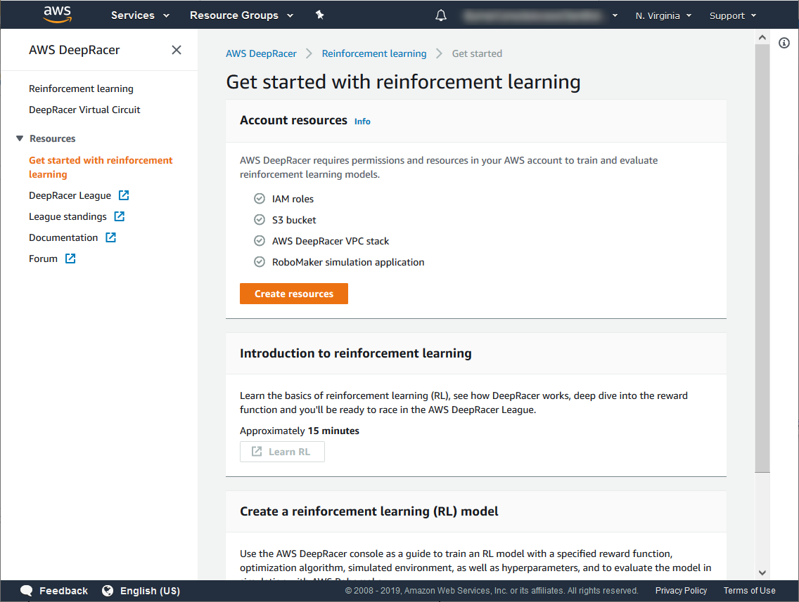
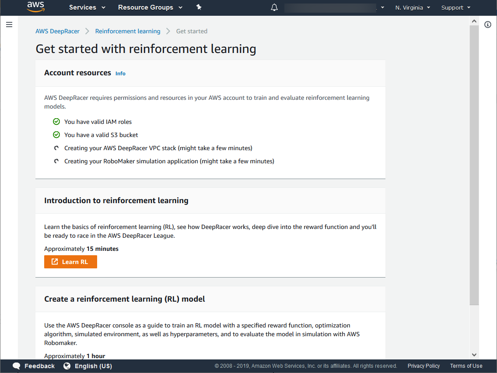
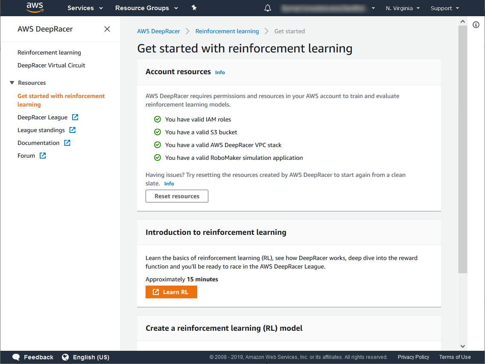

# Lab 0: Let's set up your AWS DeepRacer service and get you off to the races!

# Overview
This lab is  used to set up the required resources in your AWS DeepRacer service, so you can start training your model, and racing, when we get to the main lab.

Note if you have used the service before, and have created your resources, you can skip this lab.

# Setting up the required AWS DeepRacer service resources
Log into the [AWS Console](https://console.aws.amazon.com/deepracer/home?region=us-east-1#getStarted) using your own account.

Make sure you are in the **North Virginia** region and navigate to [AWS DeepRacer](https://console.aws.amazon.com/deepracer/home?region=us-east-1#getStarted) (https://console.aws.amazon.com/deepracer/home?region=us-east-1#getStarted).

Make sure you are on the "Get started with reinforcement learning" page.

If you have not yet selected "Create resources", please select it now.

This will set up the required IAM roles, S3 bucket, and AWS DeepRacer CloudFormation stack, and may take 10 to 15 minutes.

When finished you should see the following

Note that since we make use of a VPC, you may see an error if you are at your VPC limit. You may have to request a [VPC limit](https://docs.aws.amazon.com/vpc/latest/userguide/amazon-vpc-limits.html) increase.
