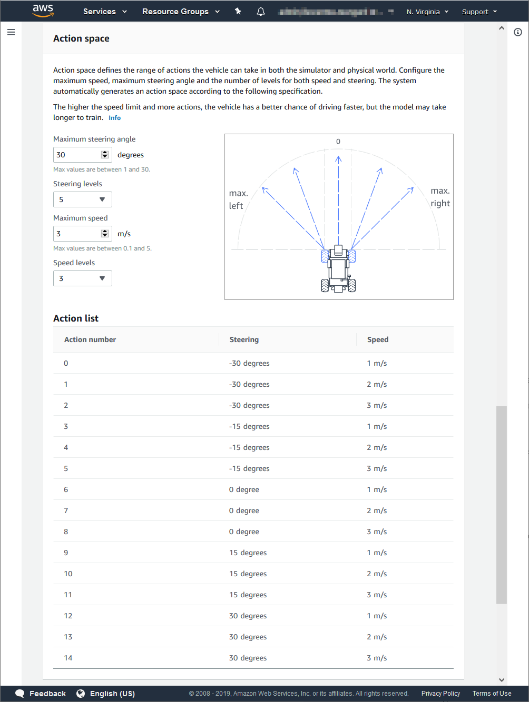
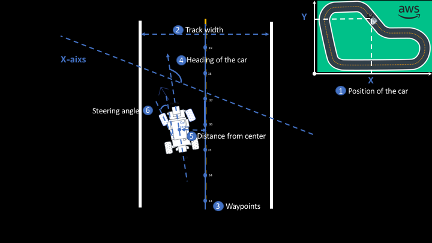
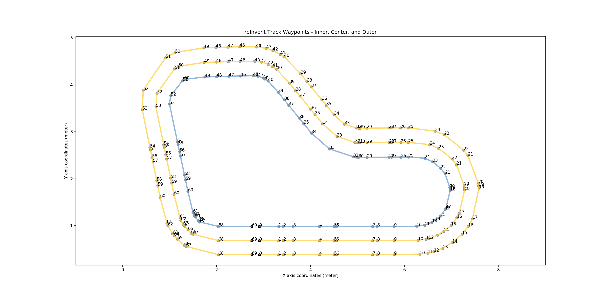
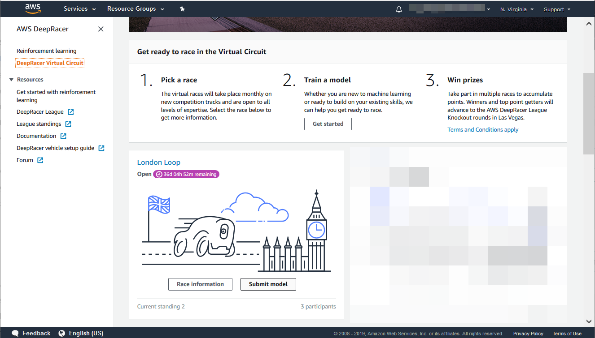
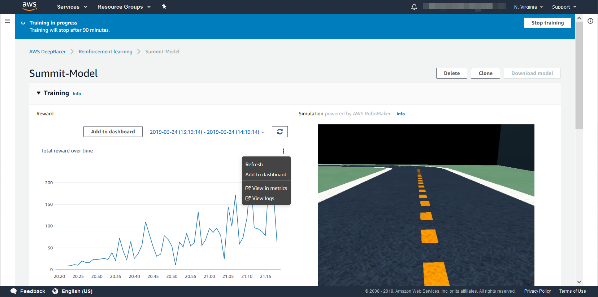
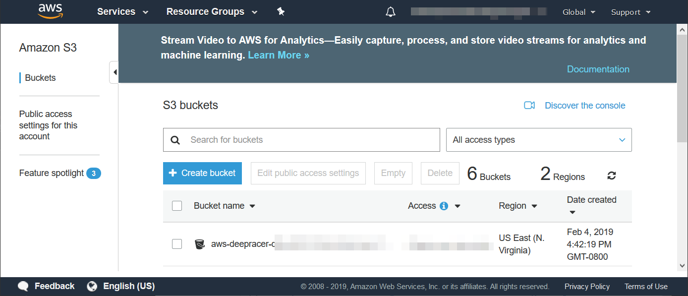

# Lab 1: ¡Construyamos un modelo AWS DeepRacer RL!

# Notas
Buscamos continuamente mejorar el servicio AWS DeepRacer para ofrecer una mejor experiencia al cliente. Por lo tanto, consulte siempre el contenido del laboratorio más reciente en GitHub ya que el contenido anterior puede estar desactualizado. Si tiene alguna consulta técnica por favor pregunte a los facilitadores del taller, y para aquellos de ustedes que realizan el laboratorio desde su casa, por favor envíen sus preguntas al [Foro de AWS DeepRacer](https://forums.aws.amazon.com/forum.jspa?forumID=318).

# Descripción general
El laboratorio tiene cuatro objetivos:
1. Familiarizarle con el servicio AWS DeepRacer en la consola de AWS
2. Explicar los conceptos necesarios para comenzar a entrenar un modelo
3. Explicar cómo puede competir en la DeepRacer League, tanto en el Circuito Virtual como en el Circuito Summit
4. Explicar cómo puede mejorar su modelo

El laboratorio se divide en tres secciones:
1. Sección 1: Entrenando a su primer modelo
2. Sección 2: Competir en la AWS DeepRacer League
3. Sección 3: Entrenamiento de modelos y mejorando su modelo

Los objetivos uno y dos se tratan en la Sección 1, el tercer objetivo está cubierto en la Sección 2 y el cuarto objetivo está cubierto en la Sección 3.

# Formato
Tendrá 50 minutos para completar el laboratorio que será suficiente tiempo para examinar detenidamente el contenido, explorar el servicio y comenzar a entrenar su primer modelo de aprendizaje por refuerzo (RL) de AWS DeepRacer. La sección 1 debe tardar entre 25 y 35 minutos, la sección 2 debe tardar unos 5 minutos, y la sección 3 tomará más tiempo del que tiene en el taller, pero es para su uso en casa.

El laboratorio proporcionará detalles sobre los distintos componentes del servicio AWS DeepRacer en la consola y tendrá la oportunidad de probarlos todos. Debería empezar a entrenar a su modelo al final de la Sección 1.

# Sugerencias
- Asegúrese de guardar su función de recompensa, y descargue su modelo entrenado con la cuenta temporal del taller. Perderá el acceso a esa cuenta después de la cumbre, y la cuenta se borrará.
- Para aquellos que deseen comenzar a entrenar un modelo directamente, nuestra sugerencia sería tomarse su tiempo y familiarizarse con los conceptos primero, antes de comenzar la construcción de modelos.
- Por favor, haga preguntas a medida que avanza a través del laboratorio y siéntase libre de tener discusiones en su mesa.
- Por último, cuando comience un trabajo de entrenamiento, ejecútelo durante al menos 90 minutos (en la pista re:Invent). Se tarda 6 minutos en preparar los servicios necesarios y su modelo necesita tiempo para explorar la pista antes de que pueda completar una vuelta. 
- Si desea continuar aprendiendo después del laboratorio, consulte el nuevo curso del equipo de formación y certificación de AWS, denominado [AWS DeepRacer: impulsado por el Aprendizaje por Refuerzo](https://www.aws.training/learningobject/wbc?id=32143)

# Sección 1: Construcción de su primer modelo
## Paso 1: Inicie sesión en el servicio AWS DeepRacer
Inicie sesión en [AWS Console](https://signin.aws.amazon.com/signin?redirect_uri=https%3A%2F%2Fconsole.aws.amazon.com%2Fconsole%2Fhome%3Fnc2%3Dh_ct%26src%3Dheader-signin%26state%3DhashArgs%2523%26isauthcode%3Dtrue&client_id=arn%3Aaws%3Aiam%3A%3A015428540659%3Auser%2Fhomepage&forceMobileApp=0) utilizando los credenciales proporcionados.
Asegúrese de que se encuentra en la región **North Virginia** y navegue hasta [AWS DeepRacer](https://console.aws.amazon.com/deepracer/home?region=us-east-1)
(https://console.aws.amazon.com/deepracer/home?region=us-east-1).

En la página de inicio de AWS DeepRacer, expanda el panel de la izquierda y seleccione ***Aprendizaje por refuerzo***.
## Paso 2: Página de lista de modelos
Una vez que seleccione Aprendizaje por refuerzo, se mostrará la página de modelos. Esta página muestra una lista de todos los modelos que ha creado y el estado de cada modelo. Si desea crear modelos aquí es donde inicia el proceso. Del mismo modo, desde esta página puede descargar, clonar y eliminar modelos.

Si no tiene ningún modelo, esta lista estará vacía y puede crear un modelo eligiendo ***Create model***. Una vez creado un modelo, puede utilizar esta página para ver el estado del modelo, por ejemplo, si está en entrenamiento o listo. Un estado de modelo de “Ready” indica que el entrenamiento del modelo se ha completado y, a continuación, puede descargarlo, evaluarlo o enviarlo a una carrera virtual. Puede hacer clic en el nombre del modelo para pasar a la página ***Model details***.
Para crear su primer modelo, seleccione ***Create model***.

## Paso 3: Crear modelo
Esta página le ofrece la posibilidad de crear un modelo RL para AWS DeepRacer y comenzar a entrenar el modelo. Hay distintas secciones en la página, pero antes de llegar a cada uno por favor desplácese todo el camino hacia abajo por la página y luego todo el camino hacia arriba para que tenga una idea del contenido. Vamos a crear un modelo que pueda utilizar el auto AWS DeepRacer para conducir de forma autónoma alrededor de una pista de carreras. Tenemos que seleccionar la pista de carreras específica, proporcionar las acciones que nuestro modelo puede elegir, proporcionar una función de recompensa que se utilizará para incentivar nuestro comportamiento de conducción deseado, y configurar los hiperparámetros utilizados durante el entrenamiento.
### **Info** **Botones**
A lo largo de la consola verá **Info** botones. Cuando se selecciona, un panel de información se deslizará sobre la pantalla desde la derecha de la ventana. Los botones de información no se dezplazarán de la página actual, a menos que seleccione un vínculo en el panel de información. Puede cerrar los paneles una vez que haya terminado.

## 3.1 Detalles del modelo
Debe comenzar en la parte superior con Detalles del modelo. Aqui puede proporcionar un nombre y una descripcion para su modelo. Si es la primera vez que utiliza el servicio, debe seleccionar el botón **Create Resources** . Esto creará las funciones de IAM que AWS DeepRacer necesita para llamar a otros servicios de AWS en su nombre, la VPC utilizada durante el entrenamiento y evaluación, la función lambda de AWS DeepRacer utilizada para validar la función de recompensa de Python 3 y el repositorio de AWS DeepRacer S3 donde se almacenarán los artefactos del modelo. Si ves un error en esta sección, por favor háganoslo saber.

Por favor, ingrese un nombre y una descripción para su modelo y continúe con la siguiente sección.

## 3.2 Simulación de entorno
Como se detalla en el taller, la formación de nuestro modelo RL se lleva a cabo en una pista de carreras simulada en nuestro simulador, y en esta sección usted elegirá la pista en la que entrenará su modelo. AWS RoboMaker se utiliza para crear el entorno de simulación.
Al entrenar a un modelo, tenga en cuenta la pista en la que desea correr. Entrena en la pista más parecida a la pista final en la que quieres correr. Aunque esto no es necesario y no garantiza un buen modelo, maximizará las probabilidades de que su modelo obtenga su mejor rendimiento en la pista de carreras. Además, si entrenas en una vía recta, no esperes que su modelo aprenda a girar.
Le proporcionaremos más detalles sobre la AWS DeepRacer League en la sección 2, pero aquí hay cosas que debe tener en cuenta al seleccionar una pista en la que entrenar si desea competir en la Liga.
- Para el [Circuito de la Cumbre](https://aws.amazon.com/deepracer/summit-circuit/), la pista de carreras en vivo será la pista re:Invent 2018, así que entrena a su modelo en la pista re:Invent si tienes la intención de competir en cualquiera de las cumbres de AWS seleccionadas.
- Cada carrera del circuito virtual tendrá su propia nueva pista de competición y no será posible entrenar directamente en las pistas de competición. En su lugar tendremos disponible una pista que será similar en tema y diseño a cada pista de competición, pero no idéntica. Esto garantiza que los modelos tengan que generalizarse y que no se puedan adaptar a la pista de competición.
En el laboratorio de hoy queremos prepararte para competir en la Cumbre, si el tiempo lo permite, así que selecciona la pista re:Invent 2018 y desplázate a la siguiente sección.

## 3.3 Espacio de acción
En esta sección se puede configurar el espacio de acción que su modelo seleccionará durante el entrenamiento, y también una vez que el modelo haya sido entrenado. Una acción es una combinación de velocidad y ángulo de dirección. En AWS DeepRacer estamos utilizando un espacio de acción discreto en lugar de un espacio de acción continuo. Para construir este espacio de acción discreto, especificará la velocidad máxima, la granularidad de la velocidad, el ángulo máximo de dirección y la granularidad de la dirección.

Entradas
- Ángulo máximo de dirección es el ángulo máximo en grados que las ruedas delanteras del coche pueden girar, a la izquierda y a la derecha. Hay un límite en cuanto a la distancia en que las ruedas pueden girar, por lo que el ángulo máximo de giro es de 30 grados.
- Los niveles de dirección se refieren al número de intervalos de dirección entre el ángulo máximo de dirección en cada lado. Por lo tanto, si su ángulo de dirección máximo es de 30 grados, entonces + 30 grados está a la izquierda y -30 grados a la derecha. Con una granularidad de dirección de 5, los siguientes ángulos de dirección, de izquierda a derecha, estarán en el espacio de acción: 30 grados, 15 grados, 0 grados, -15 grados y -30 grados. Los ángulos de dirección son siempre simétricos alrededor de 0 grados.
- Las velocidades máximas se refieren a la velocidad máxima que el coche conducirá en el simulador medida en metros por segundo.
- Los niveles de velocidad se refieren al número de niveles de velocidad desde la velocidad máxima (incluido) hasta cero (excluido). Así que si su velocidad máxima es de 3 m/s y su granularidad de velocidad es 3, entonces su espacio de acción contendrá ajustes de velocidad de 1 m/s, 2 m/s y 3 m/s. Simplemente ponga 3 m/s divide 3 = 1 m/s, así que vaya de 0 m/s a 3 m/s en incrementos de 1 m/s. 0m/s no está incluido en el espacio de acción.

Sobre la base del ejemplo anterior, el espacio de acción final incluirá 15 acciones discretas (3 velocidades x 5 ángulos de dirección), que deberían incluirse en el servicio AWS DeepRacer. Si no lo ha hecho, configure su espacio de acción. Siéntase libre de usar lo que quiera usar. Los espacios de acción más grandes pueden tardar un poco más en entrenar.

Sugerencias
- Su modelo no realizará una acción que no esté en el espacio de acción. Del mismo modo, si su modelo está entrenado en una pista que nunca requirió el uso de esta acción, por ejemplo, el giro no se incentivará en una vía recta, el modelo no sabrá cómo usar esta acción ya que no se incentivará a girar. Por lo tanto, al empezar a pensar en construir un modelo robusto, asegúrese de tener en cuenta el espacio de acción y la pista de entrenamiento.
- Especificar una velocidad rápida o un ángulo de dirección amplio es genial, pero todavía necesita pensar en su función de recompensa y si tiene sentido conducir a toda velocidad en un giro, o exhibir comprtamiento zig- zag en una sección recta de la pista.
- Nuestros experimentos han demostrado que los modelos con una velocidad máxima más rápida tardan más en converger que los que tienen una velocidad máxima más lenta.
- Para las carreras del mundo real, tendrá que jugar con la velocidad en la interfaz de usuario del servidor web de AWS DeepRacer para asegurarse de que su coche no está conduciendo más rápido de lo que aprendió en el simulador.

## 3.4 Función de recompensa
En el aprendizaje por refuerzo, la función de recompensa juega un papel **crítico** en la formación de sus modelos. La función de recompensa se utiliza para incentivar el comportamiento de conducción que desea que el agente muestre cuando utilice su modelo de RL entrenado para tomar decisiones de conducción.
La función de recompensa evalúa la calidad del resultado de una acción y recompensa la acción en consecuencia. En la práctica, la recompensa se calcula durante el entrenamiento después de que se realiza cada acción, y forma una parte clave de la experiencia (recordar que hablamos de estado, acción, siguiente estado, recompensa) utilizada para entrenar el modelo. Puede construir la lógica de la función de recompensa usando una serie de variables que están expuestas por el simulador. Estas variables representan mediciones del vehículo, como el ángulo de dirección y la velocidad, el coche en relación con la pista de carreras, como coordenadas (x, Y), y la pista de carreras, como los waypoints. Puede usar estas mediciones para construir su lógica de función de recompensa en la sintaxis de Python 3.
La siguiente tabla contiene las variables que puede utilizar en su función de recompensa. Tenga en cuenta que estos se actualizan de vez en cuando a medida que nuestros ingenieros y científicos encuentran mejores formas de hacer las cosas, así que ajuste sus funciones de recompensa anteriores en consecuencia. En el momento de la Cumbre de Singapur (10 de abril de 2019), estas variables y descripciones son correctas en el servicio AWS DeepRacer de la consola de AWS. Utilice siempre las últimas descripciones del servicio AWS DeepRacer. Tenga en cuenta que si utiliza el cuaderno SageMaker RL, tendrá que mirar la sintaxis utilizada en el propio cuaderno.

| Nombre de variable        | Sintaxis                                                                                | Tipo                     | Descripción                                                                                                                                                                                                                                                                                                                                                         |
|----------------------|---------------------------------------------------------------------------------------|--------------------------|---------------------------------------------------------------------------------------------------------------------------------------------------------------------------------------------------------------------------------------------------------------------------------------------------------------------------------------------------------------------|
| all_wheels_on_track  | params['all_wheels_on_track']                                                         | Boolean                  | Si todas las cuatro ruedas están en la pista, donde pista se define como la superficie de la carretera, incluidas las líneas de borde, all_wheels_on_track es True. Si alguna de las cuatro ruedas está fuera de la pista, all_wheels_on_track es False. Tenga en cuenta que si las cuatro ruedas están fuera de la pista, el coche se restablecerá.                                                                             |
| x                    | params['x']                                                                           | Float                    | Devuelve la coordenada x del centro del eje desde del coche, en unidades medidores.                                                                                                                                                                                                                                                                                 |
| y                    | params['y']                                                                           | Float                    | Devuelve la coordenada y del centro del eje desde del coche, en unidades medidores.                                                                                                                                                                                                                                                                                 |
| distance_from_center | params['distance_from_center']                                                        | Float [0, track_width/2] | Distancia absoluta desde el centro de la pista. El centro de la pista está determinado por la línea que vincula todos los waypoints centrales.                                                                                                                                                                                                                                      |
| is_left_of_center    | params['is_left_of_center']                                                           | Boolean                  | Variable que indica si el coche está a la izquierda del centro de la pista.                                                                                                                                                                                                                                                                                     |
| is_reversed          | params['is_reversed']                                                                 | Boolean                  | Variable que indica si el coche está entrenando en la dirección original de la pista, o en la dirección inversa de la pista.                                                                                                                                                                                                                                    |
| heading              | params['heading']                                                                     | Float (-180,180]           | Devuelve el rumbo que el coche está mirando en grados. Cuando el coche se enfrenta a la dirección del eje x aumentando (y constante y), entonces devolverá 0. Cuando el coche se enfrenta a la dirección del eje y aumentando (con x constante), entonces devolverá 90. Cuando el coche se enfrenta a la dirección del eje y disminuyendo (con constante x), entonces volverá -90. |
| progress             | params['progress']                                                                    | Float [0,100]            | Porcentaje de la pista completada. Progreso de 100 indica que la vuelta se ha completado.                                                                                                                                                                                                                                                                                   |
| steps                | params['steps']                                                                       | Integer [0,inf]                 | Número de pasos completados. Un paso es uno (estado, acción, siguiente estado, tupla de recompensa).                                                                                                                                                                                                                                                                               |
| speed                | params['speed']                                                                       | Float                    | La velocidad deseada del coche en metros por segundo. Esto debería enlazar con el espacio de acción seleccionado.                                                                                                                                                                                                                                                               |
| steering_angle       | params['steering_angle']                                                              | Float                    | El ángulo_dirección deseado del coche en grados. Esto debería enlazar con el espacio de acción seleccionado. Tenga en cuenta que los ángulos + indican ir a la izquierda, y los ángulos negativos indican ir a la derecha. Esto está alineado con el procesamiento geométrico 2d.                                                                                       |
| track_width          | params['track_width']                                                                 | Float                    | El ancho de la pista, en unidades medidores.                                                                                                                                                                                                                                                                                                                             |
| waypoints            | params['waypoints'] for the full list or params['waypoints'][i] for the i-th waypoint | List                     | Lista ordenada de waypoints, que se extienden alrededor de la pista en el centro de la pista, siendo cada elemento de la lista la coordenada (x, y) del waypoint. La lista comienza en cero.                                                                                                                                                                            |
| closest_waypoints    | params['closest_waypoints'][0] or params['closest_waypoints'][1]                      | Integer                  | Devuelve una lista que contiene el índice de waypoint anterior más cercano y el índice waypoint siguiente. params ['closest_waypoints'][0] devuelve el índice de waypoint anterior más cercano y params ['closest_waypoints'][1] devuelve el índice de waypoint siguiente más cercano.                                                                                                         |

Aquí hay una explicación visual de algunos de los parámetros de la función de recompensa.

Aquí está una visualización de los waypoints utilizados para la pista re:Invent. Solo tendrás acceso a los puntos de referencia de la línea central en su función de recompensa. Tenga en cuenta también que puede recrear este gráfico simplemente imprimiendo la lista de waypoints en su función de recompensa y luego trazándolos. Cuando utilice una función de impresión en su función de recompensa, la salida se colocará en los registros de AWS Robomaker. Puedes hacer esto para cualquier pista en la que puedas entrenar. Discutiremos los registros más tarde.

Un método útil para llegar a una función de recompensa, es pensar en el comportamiento que usted piensa que un coche que conduce bien exhibirá. Un ejemplo simple sería recompensar el coche por permanecer en la carretera. Esto se puede hacer estableciendo recompensa = 1, siempre. Esto funcionará en nuestro simulador, porque cuando el coche sale de la pista lo restablecemos, y el coche comienza de nuevo en la pista, así que no tenemos que tener un comportamiento gratificante que nos lleva fuera de la pista. Sin embargo, esta probablemente no sea la mejor función de recompensa, ya que ignora por completo todas las demás variables que se pueden usar para crear una buena función de recompensa.

A continuación ofrecemos algunos ejemplos de funciones de recompensa.

**Ejemplo 1**: Función de recompensa básica que promueve el seguimiento de la línea central. Aquí primero creamos tres bandas alrededor de la pista, usando los tres marcadores, y luego procedemos a recompensar al coche más por conducir en la banda estrecha en lugar de la banda media o la banda ancha. También tenga en cuenta las diferencias en el tamaño de la recompensa. Proporcionamos una recompensa de 1 por permanecer en la banda estrecha, 0.5 por permanecer en la banda media y 0.1 por permanecer en la banda ancha. Si disminuimos la recompensa por la banda estrecha, o aumentamos la recompensa por la banda media, esencialmente estamos incentivando al coche a utilizar una porción más grande de la superficie de la pista. Esto podría ser útil, especialmente cuando hay esquinas afiladas.

    def reward_function(params):
        '''
        Ejemplo de recompensa al agente por seguir la línea central
        '''

        # Calcula 3 marcas que están más lejos y más lejos de la línea central
        marker_1 = 0.1 * params['track_width']
        marker_2 = 0.25 * params['track_width']
        marker_3 = 0.5 * params['track_width']

        # Dale una recompensa mayor si el coche está más cerca de la línea central y viceversa
        if params['distance_from_center'] <= marker_1:
            reward = 1.0
        elif params['distance_from_center'] <= marker_2:
            reward = 0.5
        elif params['distance_from_center'] <= marker_3:
            reward = 0.1
        else:
            reward = 1e-3  # likely crashed/ close to off track

        return float(reward)
Sugerencia: No proporcione recompensas iguales a cero. El optimizador específico que estamos usando lucha cuando la recompensa dada es cero. Por lo tanto, inicializamos la recompensa con un valor pequeño.

**Ejemplo 2**: Función de recompensa avanzada que penaliza la dirección excesiva y promueve el seguimiento de la línea central.

    def reward_function(params):
        '''
       Ejemplo que penaliza la dirección, lo que ayuda a mitigar los comportamientos zig-zag
        '''
        # Calcula 3 marcas que están más lejos y más lejos de la línea central
        marker_1 = 0.1 * params['track_width']
        marker_2 = 0.25 * params['track_width']
        marker_3 = 0.5 * params['track_width']
        # Dale una recompensa mayor si el coche está más cerca de la línea central y viceversa
        if params['distance_from_center'] <= marker_1:
            reward = 1
        elif params['distance_from_center'] <= marker_2:
            reward = 0.5
        elif params['distance_from_center'] <= marker_3:
            reward = 0.1
        else:
            reward = 1e-3  # likely crashed/ close to off track
        #  Límite de cambio del volante de dirección, cambie el número en función de la configuración del espacio de acción
        ABS_STEERING_THRESHOLD = 15
        # Penalizar la recompensa si el coche está conduciendo demasiado
        if abs(params['steering_angle']) > ABS_STEERING_THRESHOLD:  #Solo necesita el ángulo de dirección absoluto
            reward *= 0.5
        return float(reward)

**Ejemplo 3**: Función de recompensa avanzada que penaliza ir lento y promueve el seguimiento de la línea central.

    def reward_function(params):
        '''
        Ejemplo que penaliza la conducción lenta. Esto crea una función de recompensa no lineal por lo que puede tardar más en aprender.
        '''
        # Calcula 3 marcas que están más lejos y más lejos de la línea central
        marker_1 = 0.1 * params['track_width']
        marker_2 = 0.25 * params['track_width']
        marker_3 = 0.5 * params['track_width']
        # Dale una recompensa mayor si el coche está más cerca de la línea central y viceversa
        if params['distance_from_center'] <= marker_1:
            reward = 1
        elif params['distance_from_center'] <= marker_2:
            reward = 0.5
        elif params['distance_from_center'] <= marker_3:
            reward = 0.1
        else:
            reward = 1e-3  # likely crashed/ close to off track
        # penalizar la recompensa por el coche tomando acciones lentas
        # la velocidad está en m/s
        # abajo asume que su espacio de acción tiene una velocidad máxima de 5 m/s y una granularidad de velocidad de 3
        # Penalizamos cualquier velocidad inferior a 2m/s
        SPEED_THRESHOLD = 2
        if params['speed'] < SPEED_THRESHOLD:
            reward *= 0.5
        return float(reward)
Usando los ejemplos anteriores, ahora puede proceder a crear su propia función de recompensa. Estos son algunos consejos adicionales:
- Puedes utilizar los waypoints para calcular la dirección de un waypoint a otro. 
- Puedes usar la regla de la derecha de los juegos 2D para determinar en qué lado de la pista estás.
- Puedes escalar recompensas exponencialmente, limitarlas a 10.000.
- Ten en cuenta su espacio de acción al usar speed y steering_angle en su función de recompensa
- Para realizar un seguimiento de los episodios en los registros donde su coche logra completar una vuelta, considera dar una bonificación de final (también conocida como recompensa + = 10000) donde el progreso = 100. Esto se debe a que una vez que el coche complete una vuelta, el progreso no irá más allá de 100, pero la simulación continuará. El modelo seguirá entrenando hasta alcanzar el tiempo de parada, pero eso no implica que el modelo final sea el mejor modelo, especialmente cuando se trata de carreras en el mundo real. Esta es una solución temporal que resolveremos.

Una vez que haya terminado de crear su función de recompensa, asegúrese de usar el botón **Validate** para verificar que la sintaxis del código esta correcta antes de que comience el entrenamiento. Cuando comiences a entrenar, esta función de recompensa se almacenará en un archivo de S3, pero también asegúrate de copiarla y almacenarla en algún lugar para que sea segura.

Aquí está mi función de recompensa de ejemplo usando el primer ejemplo anterior.

Desplácese a la siguiente sección.

## 3.5 Configuración del algoritmo
Esta sección especifica los hiperparámetros que utilizará el algoritmo de aprendizaje por refuerzo durante el entrenamiento. Los hiperparámetros se utilizan para mejorar el rendimiento del entrenamiento.

Antes de sumergirnos, vamos a repasar algunos términos que usaremos para asegurarnos de que está familiarizado con lo que significan.

Un **paso (step)**, también conocido como experiencia, es una tupla de (s,a,r,s'), donde s significa una observación (o estado) capturada por la cámara, a para una acción tomada por el vehículo, r para la recompensa esperada incurrida por dicha acción, y s' para la nueva observación (o nuevo estado) después de que se tome la acción.

Un **episodio (episode)** es un período en el que el vehículo comienza desde un punto de partida determinado y termina completando la pista o saliendo de la pista. Por lo tanto, un episodio es una secuencia de pasos, o experiencia. Diferentes episodios pueden tener diferentes longitudes.

Un **búfer de experiencia (experience buffer)** consiste en una serie de pasos ordenados recompilados sobre un número fijo de episodios de diferentes longitudes durante el entrenamiento. Sirve como la fuente de la que se extrae la entrada para actualizar las redes neuronales subyacentes (política y valor).

Un **lote (batch)** es una lista ordenada de experiencias, que representa una parte de la experiencia obtenida en la simulación durante un período de tiempo, y se utiliza para actualizar los pesos de red de directivas.

Un conjunto de lotes “muestreados” aleatoriamente de un búfer de experiencia se denomina **conjunto de datos de entrenamiento (training data set)** y se utiliza para entrenar los pesos de red de directivas.

Nuestros científicos han probado estos parámetros mucho, y en base a la pista re:Invent y un pequeño espacio de acción estos parámetros funcionan bien, así que siéntase libre de dejarlos como están. Sin embargo, considere cambiarlos a medida que comience a iterar sus modelos, ya que pueden mejorar significativamente la convergencia de entrenamiento.

| Parámetro                                | Descripción                                                                                                                                                                                                                                                                                                                                                                                                                                                                                                                                                                      |
|------------------------------------------|----------------------------------------------------------------------------------------------------------------------------------------------------------------------------------------------------------------------------------------------------------------------------------------------------------------------------------------------------------------------------------------------------------------------------------------------------------------------------------------------------------------------------------------------------------------------------------|
| Tamaño del lote (Batch size)                               | Número reciente de experiencias de vehículos muestreadas al azar a partir de un búfer de experiencia y utilizadas para actualizar los pesos subyacentes de la red neuronal de aprendizaje profundo. Si tiene 5120 experiencias en el búfer y especifica un tamaño de lote de 512, ignorando el muestreo aleatorio, obtendrá 10 lotes de experiencia. Cada lote se utilizará, a su vez, para actualizar los pesos de la red neuronal durante el entrenamiento. Utilice un tamaño de lote mayor para promover actualizaciones más estables y suaves de los pesos de la red neuronal, pero tenga en cuenta la posibilidad de que el entrenamiento sea más lento. |
| Número de épocas (Epochs)                         |  Una época representa un paso a través de todos los lotes, donde los pesos de la red neuronal se actualizan después de que se procesa cada lote, antes de pasar al siguiente lote. 10 épocas implican que actualizará las ponderaciones de la red neuronal, utilizando todos los lotes de uno en uno, pero que repetirá este proceso 10 veces. Use un número mayor de épocas para promover actualizaciones más estables, pero espere un entrenamiento más lento. Cuando el tamaño del lote es pequeño, puedes usar un número menor de épocas.                                                                                                         |
| Tasa de aprendizaje (Learning rate)                            |  La tasa de aprendizaje controla el tamaño de las actualizaciones de los pesos de la red neuronal. En pocas palabras, cuando necesite cambiar los pesos de su póliza para llegar a la recompensa acumulada máxima, cuánto debe cambiar su póliza. Una mayor tasa de aprendizaje conducirá a una formación más rápida, pero puede que tenga dificultades para converger. Las tasas de aprendizaje más reducidas conducen a una convergencia estable, pero pueden tardar mucho tiempo en formarse.                                                                                                                                                                   |
| Exploración (Exploration)                             |  Esto se refiere al método utilizado para determinar la compensación entre exploración y explotación. En otras palabras, qué método debemos usar para determinar cuándo debemos dejar de explorar (elegir acciones al azar) y cuándo deberíamos aprovechar la experiencia que hemos acumulado. Puesto que vamos a utilizar un espacio de acción discreto, siempre debe seleccionar CategoríaParameters.                                                                                                                                                                                                   |
| Entropía (Entropy)                                  | Un grado de incertidumbre, o aleatoriedad, añadido a la distribución de probabilidad del espacio de acción. Esto ayuda a promover la selección de acciones aleatorias para explorar el espacio de estado/acción de forma más amplia.                                                                                                                                                                                                                                                                                                                                                                            |
| Factor de descuento (Discount factor)                          | Factor que especifica cuánto contribuyen las recompensas futuras a la recompensa acumulativa esperada. Cuanto mayor sea el factor de descuento, más lejos estará el modelo para determinar la recompensa acumulativa esperada y más lento será el entrenamiento. Con un factor de descuento de 0.9, el vehículo incluye recompensas de un orden de 10 pasos futuros para realizar un movimiento. Con un factor de descuento de 0.999, el vehículo considera recompensas de un orden de 1000 pasos futuros para hacer un movimiento. Los valores de factor de descuento recomendados son 0.99, 0.999 y 0.9999.                                         |
| Tipo de pérdida (Loss type)                                | El tipo de pérdida especifica el tipo de función objetivo (función de coste) utilizado para actualizar los pesos de la red. Los tipos de pérdida de error cuadrado Huber y Mean se comportan de manera similar para pequeñas actualizaciones. Pero a medida que las actualizaciones se hacen más grandes, la pérdida de Huber toma incrementos menores en comparación con la pérdida de error cuadrado media. Cuando tenga problemas de convergencia, utilice el tipo de pérdida Huber. Cuando la convergencia sea buena y desee entrenar más rápido, utilice el tipo de pérdida de error cuadrado medio.                                                                                                      |
| Número de episodios entre cada entrenamiento (Number of episodes between each training) |  Este parámetro controla la cantidad de experiencia que el coche debe obtener entre cada iteración de entrenamiento modelo. Para problemas más complejos que tienen más máximos locales, es necesario un búfer de experiencia más grande para proporcionar puntos de datos más no correlacionados. En este caso, el entrenamiento será más lento pero más estable. Los valores recomendados son 10, 20 y 40.                           |

Tenga en cuenta que después de cada iteración de entrenamiento, guardaremos el nuevo archivo de modelo en su bucket S3. El servicio AWS DeePrager no mostrará todos los modelos formados durante una carrera de formación, solo el último modelo. Vamos a ver esto en la Sección 3.

## 3.6 Condiciones de parada
Esta es la última sección antes de comenzar el entrenamiento. Aquí puede especificar el tiempo máximo para el que entrenará su modelo. Idealmente, debe poner un número en esta condición. Siempre puedes dejar de entrenar temprano. Además, si su modelo se detuvo como resultado de la condición, puede ir a la pantalla de lista de modelos y clonar su modelo para reiniciar el entrenamiento utilizando nuevos parámetros.

Especifique 90 minutos y, a continuación, seleccione **Start training**. Si hay un error, se le llevará a la ubicación del error. Tenga en cuenta que la sintaxis de Python también se validará de nuevo. Una vez iniciado el entrenamiento, puede tardar hasta 6 minutos en aumentar los servicios necesarios para iniciar el entrenamiento. Durante este tiempo vamos a hablar a través de AWS DeepRacer League y cómo puede participar.

Nota De 25 a 35 minutos de tiempo de laboratorio deberían haber transcurrido para este punto.

Sugerencia: Asegúrate de guardar su función de recompensa y descarga su modelo entrenado de la cuenta quemadora. Perderás el acceso a la cuenta después de la Cumbre, y la cuenta se borrará.

# Sección 2: Competir en la AWS DeepRacer League
La [AWS DeepRacer League](https://aws.amazon.com/deepracer/league/) es la primera liga autónoma mundial de carreras. La Liga tendrá lugar en 2019 en persona, en varios lugares seleccionados, y en línea. Compite y ganarás uno de los muchos premios de AWS DeepRacer, o uno de los 47 viajes pagados para re: Invent 2019, donde podrá participar en las rondas de Knockout de AWS DeePracer. Si logras superar los Knockouts, podrás competir en la AWS DeepRacer Championship Cup. [Términos y condiciones inserte el enlace aquí]() se aplican.

Las carreras en persona se conocen como el Circuito de la Cumbre, y las carreras en línea se conocen como el Circuito Virtual. Las ubicaciones de los eventos del Circuito Summit se pueden encontrar [aquí](https://aws.amazon.com/deepracer/summit-circuit/). Los detalles del circuito virtual se anunciarán cuando se abra el servicio AWS DeepRacer para disponibilidad general. No es necesario poseer un AWS DeepRacer para participar en ninguna de las dos formas de competencia.

## Carreras en el circuito Summit
Para competir en el circuito Summit, debe llevar su modelo AWS DeepRacer RL entrenado a Summit en una memoria USB en una carpeta llamada modelos. Tenga en cuenta que también proporcionaremos modelos estándar como parte de una experiencia de paseo para aquellos que no pudieron entrenar a sus propios modelos. En cada uno, incluso tendrá que hacer cola para el tiempo en la pista, por orden de llegada, o como lo determinó el organizador de la Cumbre, y tener 4 minutos para intentar obtener el mejor tiempo de vuelta utilizando su modelo y un coche estándar de AWS DeepRacer que vamos a poner a disposición para correr en la pista de carreras. La pista de carreras será la pista re: Invent 2018, así que entrena a su modelo en la pista re: Invent si tienes la intención de competir en cualquiera de las cumbres de AWS seleccionadas. El piloto más rápido de cada carrera del Summit Circuit procederá a re: Invent y el top 10 de cada carrera ganará los coches de AWS DeepRacer.

## Carreras en el circuito virtual
Para competir en el circuito virtual tendrá que introducir sus modelos en cada carrera, enviándolos a través del servicio AWS DeepRacer en la consola de AWS. Las carreras de circuitos virtuales se pueden ver en la sección [DeepRacer Virtual Circuit](https://console.aws.amazon.com/deepracer/home?region=us-east-1#leaderboards) del servicio AWS DeepRacer.

Desplácese hacia abajo para ver una lista de carreras abiertas

Para ver más información sobre la carrera, selecciona la información de la carrera.

Una vez que tengas un modelo entrenado, puedes enviarlo a la carrera abierta actual. El servicio AWS DeepRacer evaluará su modelo en la pista de competición indicada. Después de que su modelo haya sido evaluado, verá su actualización de pie si su tiempo de vuelta fue mejor que su envío anterior.

Cada carrera en el Circuito Virtual tendrá su propio circuito de competición y no será posible entrenar directamente en las pistas de competición. En su lugar haremos disponible una pista que será similar en tema y diseño a cada pista de competición, pero no idéntica. Esto garantiza que los modelos tengan que generalizarse, y que no se puedan adaptar a la pista de competición. El piloto más rápido de cada carrera en el Circuito Virtual procederá a re: Invent y el top 10 de cada carrera ganará los coches AWS DeepRacer.

***Sugerencia***: El servicio DeepRacer no admite actualmente la importación de modelos, pero todavía puede guardar su archivo model.tar.gz, así como todos los artefactos de formación de modelos. El modelo final se almacena como archivo model.tar.gz en una carpeta llamada DeePracer-SageMaker-rlmdl-cuenta número de fecha en su depósito DeepRacer S3. Los modelos provisionales se almacenan como archivos.pd en una carpeta llamada DeepRacer-SageMaker-RoboMaker-comm-account number-date

Después de cada evento en el Circuito de la Cumbre y en el Circuito Virtual, todos los corredores que participaron recibirán puntos en función del tiempo que tardaron en completar la carrera. Los puntos se acumularán a lo largo de la temporada, y al final de las temporadas se invitará a participar en re: Invent. Consulte [términos y condiciones, introduzca el enlace aquí](https://aws.amazon.com/deepracer/faqs/#AWS_DeepRacer_League) para obtener más información.

# Sección 3: Entrenando y Mejorando Su Modelo
## 3.1: Mientras su modelo está entrenando
Después de que su modelo haya comenzado a entrenar, puede seleccionarlo de los modelos enumerados. A continuación, puede ver cómo está progresando el entrenamiento mirando el gráfico de recompensa total por episodio, y también en la vista en primera persona desde el coche en el simulador.

Al principio su coche no será capaz de conducir en una carretera recta, pero a medida que aprende mejor comportamiento de conducción usted debe ver mejorar su rendimiento, y el gráfico de recompensas aumenta. Además, cuando el coche conduce fuera de la pista se restablecerá en la pista. No se alarme si su coche no arranca en la misma posición. Hemos habilitado el round robin para permitir que el coche comience en puntos posteriores de la pista cada vez para asegurarnos de que puede entrenar en la experiencia de toda la pista. Además, durante el entrenamiento puede ver que su coche comienza a entrenar en la dirección opuesta de la pista. Esto también se hace para asegurar que el modelo se generalice mejor, y no se vea atrapado por un recuento asimétrico entre los giros de la izquierda y la derecha. Por último, si ves que su coche se desvía sin rumbo y no se reinicia, es cuando la experiencia obtenida se envía de vuelta a Amazon SageMaker para entrenar el modelo. Una vez actualizado el modelo, el nuevo modelo se enviará de vuelta a AWS RoboMaker y el vehículo se reanudará.

Puede consultar los archivos de registro de Amazon SageMaker y AWS RoboMaker. Los registros se muestran en Amazon CloudWatch. Para ver los registros, coloque el ratón sobre el gráfico de recompensas y seleccione los tres puntos que aparecen debajo del botón de actualización. A continuación, seleccione ***View logs***.

Verá los registros de la validación de Python lambda, Amazon SageMaker y AWS RoboMaker.

Cada carpeta contendrá los registros de todos los trabajos de formación que haya ejecutado en AWS DeepRacer. Los registros de RoboMaker de AWS contendrán la salida del simulador y los registros de Amazon SageMaker contendrán la salida de la formación del modelo. Si hay algún error, los registros son un buen lugar para comenzar.

El servicio AWS DeepRacer utiliza Amazon SageMaker, AWS RoboMaker, Amazon S3, Amazon Kinesis Video Streams, AWS Lambda y Amazon CloudWatch. Puede navegar a cada uno de estos servicios para obtener una actualización del estado del servicio o para obtener otra información útil.
En cada servicio verá una lista de trabajos actuales y anteriores, donde se conservan. A continuación se muestra una vista de los trabajos de formación ejecutados en Amazon SageMaker.

En Amazon SageMaker podrá ver los registros, así como la utilización de la instancia de EC2 que se ha creado para ejecutar la formación.

En AWS RobMoMaker puede ver la lista de todos los trabajos de simulación y, en el caso de los trabajos activos, puede obtener una vista directa del entorno de simulación.

Puede seleccionar el trabajo de simulación activo de la lista y, a continuación, seleccionar el icono Gazebo.

Esto abrirá una nueva ventana que muestra el entorno de simulación. **Tenga cuidado en este entorno porque cualquier cambio que haga en él afectará a su simulación en tiempo real. Por lo tanto, si arrastra o rota accidentalmente el vehículo o el medio ambiente, puede afectar negativamente a su trabajo de entrenamiento.**

Normalmente, la secuencia de vídeo de Amazon Kinesis se elimina después de su uso para liberar espacio y debido a los límites del número de secuencias. Tenga en cuenta también que en la actualidad el video aún no está almacenado en su cuenta S3, tanto para capacitación como para evaluaciones.

Amazon S3 almacenará el modelo final, al que se hace referencia en el servicio AWS DeepRacer, y los modelos provisionales capacitados durante sus trabajos de formación en el bucket aws-deepracer. Tus funciones de recompensa también se almacenarán en el mismo cubo (bucket).

El modelo final se almacena como archivo model.tar.gz en una carpeta llamada DeepRacer-SageMaker-rlmdl-cuenta nnumber-date en su DeepRacer S3 Bucket.

Los modelos provisionales se almacenan como archivos .pd en una carpeta llamada DeepRacer-SageMaker-RoboMaker-comm-account number-date

En el momento de escribir, el servicio AWS DeepRacer sólo puede hacer referencia a un modelo final para cada trabajo de formación. Sin embargo, si desea intercambiar el modelo entrenado durante la iteración de entrenamiento final, con cualquier modelo entrenado en las iteraciones de entrenamiento corriendo hasta la final, puede simplemente intercambiar el archivo model.pb en el archivo model.tar.gz final. Tenga en cuenta que no debe cambiar los otros archivos en el archivo.tar.gz, ya que esto puede hacer que el modelo sea inútil. Haga esto después de que su modelo haya dejado de entrenar, o después de haber dejado de entrenar manualmente.

## 3.2: Evaluación del rendimiento de su modelo
Puede que no tenga tiempo en el taller para hacer desde el paso 2 en adelante. Una vez completado el entrenamiento del modelo, puede comenzar la evaluación del modelo. En la página de detalles del modelo, donde ha observado el entrenamiento seleccione **Start evaluation**. Ahora puede seleccionar la pista en la que desea evaluar el rendimiento de su modelo y también el número de vueltas. Seleccione la pista re: Invent 2018 y 5 vueltas y seleccione Inicio.

Una vez hecho usted debe ver algo de la siguiente manera.

## 3.3: Carrera en AWS DeepRacer League
Si está satisfecho con su modelo, puede competir en el [Summit Circuit](https://aws.amazon.com/deepracer/summit-circuit/) o ahora mismo en [Virtual Circuit](https://console.aws.amazon.com/deepracer/home?region=us-east-1#leaderboards). Puede enviar su modelo entrenado a la carrera abierta actual del Circuito Virtual [aquí](https://console.aws.amazon.com/deepracer/home?region=us-east-1#leaderboards).

## 3.4: Iterando y mejorando su modelo
En base a la evaluación del modelo, debe tener una buena idea si su modelo puede completar y realizar un seguimiento fiable, y cuál es el tiempo medio de vuelta. Tenga en cuenta que para las carreras de Circuito Virtual tendrá que completar un cierto número de vueltas consecutivamente con su modelo, y así centrarse en la construcción de un modelo fiable. El número de vueltas se determinará carrera por carrera.

En este punto tienes que experimentar e iterar en su función de recompensa e hiperparámetros. Lo mejor es probar algunas funciones de recompensa diferentes basadas en diferentes comportamientos de conducción, y luego evaluarlas en el simulador para seleccionar la mejor performance. Si tiene un AWS DeepRacer, también puede probarlos en el mundo real.
Sugerencias:
- Aumentar el tiempo de entrenamiento más allá. Si su modelo no puede completar una vuelta de forma fiable, intente extender su tiempo de entrenamiento de modelo.
- Intente modificar el espacio de acción aumentando la velocidad máxima para obtener tiempos de vuelta más rápidos.
- Ajuste su función de recompensa para incentivar a su coche a conducir más rápido: querrá modificar específicamente el progreso, los pasos y las variables de velocidad.
- Clone su modelo para aprovechar la experiencia de entrenamiento. Tenga en cuenta que no podrá cambiar el espacio de acción una vez que se clona un modelo; de lo contrario, el trabajo fallará.

## 3.5: Analice el rendimiento del modelo inspeccionando los registros de Robomaker
Si desea ir un paso más allá, puede evaluar el rendimiento de cada modelo que fue entrenado durante el trabajo de capacitación inspeccionando el archivo de registro. Para descargar el archivo de registro de CloudWatch, puede utilizar el siguiente código con [Amazon CLI](https://docs.aws.amazon.com/polly/latest/dg/setup-aws-cli.html).

**Descargue el registro de AWS RoboMaker desde CloudWatch**

1. [Análisis rápido] Obtener las últimas 10000 líneas del registro
    aws logs get-log-events —log-group-name  "/aws/robomaker/SimulationJobs"  —log-stream-name  "<STREAM_NAME>" —output text —region us-east-1 > deepracer-sim.log
2. [Exportar registro completo] Copie el registro de Amazon Cloudwatch a Amazon S3. Siga el enlace para exportar todos los registros a [Amazon S3](https://docs.aws.amazon.com/AmazonCloudWatch/latest/logs/S3ExportTasks.html)

Ahora puede analizar el archivo de registro utilizando Python Pandas y ver qué iteraciones de modelo proporcionaron la recompensa total más alta. Además, si agregó una bonificación de fin, puede ver qué iteraciones de modelo fueron capaces de terminar una vuelta. Estos modelos son buenos candidatos para probar en el simulador y en el mundo real.

