# Lab 1: Get ready to race by building your own AWS DeepRacer RL model!

# Notes
- After the lab, make sure you check out new features in the console: **Garage**, where you can customize the sensors on your car, and **Community races** where you can create your own virtual races in the AWS console that you can race in with friends and colleagues.
- **DeepRacer will have three racing formats in 2020**, namely time-trial, object avoidance, and head-to-head racing. Time-trial racing involves racing a single car on an unobstructed track with the goal of setting the fastest lap time possible. Object avoidance racing is similar to time-trial racing, however, there are objects on the track while the single car is racing for the fastest lap time. Head-to-head racing involves two cars racing on the same track simultaneously to see who crosses the finish line first.
- **In this lab we are targeting a time-trial model. You can only race time-trial models at the MGM Grand Garden and Quad at Aria, at re:Invent 2019**. Furthermore, you can get a reasonable time-trial model within 120 minutes of training. If you decide to deviate and train a head-to-head or object avoidance model, these models can take in excess of 10 hours to train after which you can evaluate your model's performance in the console.
-  Join us in the **[AWS DeepRacer Slack Community](https://deepracer-community.slack.com/)** or post your questions to the [AWS DeepRacer forum](https://forums.aws.amazon.com/forum.jspa?forumID=318).
- If you want to continue learning after the lab, please check out the online video course by the AWS Training and Certification team, called **[AWS DeepRacer: Driven by Reinforcement Learning](https://www.aws.training/learningobject/wbc?id=32143)**.


# Overview
The lab has four goals:

1. familiarize you with AWS DeepRacer in the AWS console,
2. explain the concepts needed and to get you started training a time-trial model so you can go race at the MGM,
3. explain how you can take part in the virtual warm-up races or create your own virtual races in preparation for the 2020 AWS DeepRacer League, and
4. explain how you can improve your models.

The lab is split into three sections:

- Section 1: Training your first time-trial model so you can go race at the MGM,
- Section 2: Preparing for the 2020 AWS DeepRacer League, and
- Section 3: Model training and improving your model.

Goals one and two are covered in Section 1, goal three is covered in Section 2, and goal four is covered in Section 3.

# Timing
**You will have 50 minutes to complete the lab** and this is enough time to thoroughly go through the content, explore the service, and start training your first AWS DeepRacer reinforcement learning (RL) model. Section 1 should take about 25 to 35 minutes, Section 2 should take about 5 minutes, and Section 3 will take more time than you have in the workshop but is for use at home.

The lab will provide detail on the various components in the AWS DeepRacer service in the console and you will get the chance to try them all out. **You should start training your model at the end of Section 1.**


# Housekeeping
- Please ensure you **load the AWS service credits** provided.
- If you don't have an AWS account, please create one, or ask facilitators if there are burner accounts available. Please make sure you save your reward function, and download your trained model from the burner account. You will lose access to the burner account after the workshop, and the account will be wiped.
- For those eager to start training a job, our hint would be take your time and familiarize yourself with the concepts first, before starting model training.
- Please ask questions as you progress through the lab and feel free to have discussions at your table. 
- Lastly, when you do start a training job, run it for at least 90 minutes. It takes 6 minutes to spin up the services needed and your model needs time to explore the track before it will manage to complete a lap.
- **Info** buttons. Throughout the console you will see **Info** buttons. When selected, an information pane will slide onto the screen from the right of the window. Info buttons will not navigate away from the current page, unless you select a link in the information pane. You can close the panes once you are done.


# Section 1: Training your first model
## Step 1: Login to the AWS DeepRacer service and create resources
Log into the [AWS Console](https://console.aws.amazon.com/deepracer/home?region=us-east-1#getStarted).

Make sure you are in the **N. Virginia** region and navigate to [AWS DeepRacer](https://console.aws.amazon.com/deepracer/home?region=us-east-1#getStarted) (Link:: https://console.aws.amazon.com/deepracer/home?region=us-east-1#getStarted).



If you have not yet created resources, please click the "Create Resources" button. This will take ~5 minutes to complete. This gives AWS DeepRacer permission to call Amazon SageMaker and AWS RoboMaker on your behalf, as well as spins up a CloudFormation stack that will manage the VPCs for Amazon SageMaker and AWS RoboMaker. Do not press the "Reset resources" button as this will delete the stack and restart the process. Please see [Lab 0 Create resources](https://github.com/aws-samples/aws-deepracer-workshops/tree/master/Workshops/2019-AWSSummits-AWSDeepRacerService/Lab0_Create_resources) for more details.

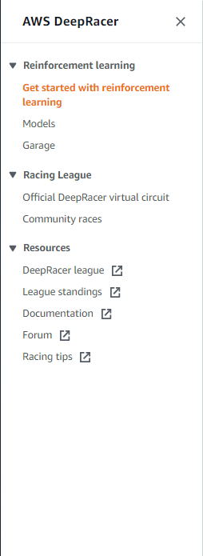

While the stack is being created we can call out items in the left-hand navigation bar:

- **Get started with reinforcement learning**: Get an interactive introduction to RL.
- **Models**: View your list of models, create new models, or clone existing models.
- **New! Garage**: You can now customize your own virtual cars by experimenting with different sensor combinations and neural network selections. This is also where you specify the action space for your car.
- **Official DeepRacer Virtual Circuit**: Get ready for the 2020 League by training your models and racing in the pre-season races here.
- **New! Community Races**: Create your own virtual races that you can share with friends and colleagues.

Let's dive into the Garage first, as this is where we will customize the car we will use during model training. Please expand the left hand navigation bar and select **Garage**.

## Step 2: Garage
When you visit the **Garage** for the first time you will be presented with an overview of the Garage, which you can revisit using the Info bar on the right. The Garage allows you to create and customize your own virtual cars that you will then use to train models for. By default ,the Garage contains the **The Original DeepRacer**. The original DeepRacer uses a single front-facing camera, a 3 layer convolutional neural network, and a maximum speed action space of 1m/s.

Note: If you have used AWS DeepRacer before, the action space speeds have been updated to provide a closer match to real world speeds. A quick rule of thumb is to take your old model's speed and divide it by 3. This gets you to the current console value.

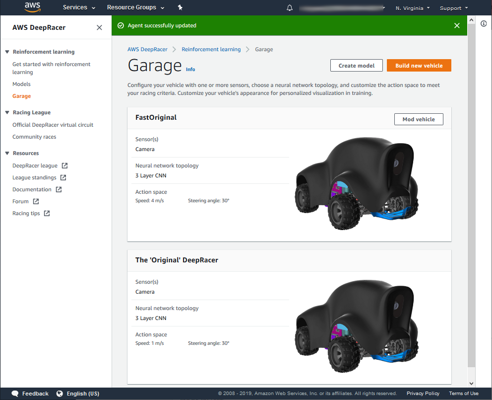

Select the "Build a new vehicle" button.

### 2.1 Mod your own vehicle



In this page you can select the sensor combination for your car, and also the neural network that will be trained when training your model. The sensors provide additional inputs to your model about the environment, and have different pros and cons. Depending on your race type you may opt for a simple sensor and shallow network, whereas more complex challenges like head-to-head racing may need more complex sensors and a deeper network that can learn more complex features and behaviors.

- If you want to race in a single car on track time-trial race consider using the single camera. To race around a track without other cars or obstacles you don't need a complex input, furthermore, the more complex you go the longer training will take.
- Consider using a stereo camera sensor when you want to build an object avoidance model or head-to-head racing model. You will need to use the reward function in such a way that the model learns the depth features from your images, something that is doable with stereo cameras. Note that in head-to-head racing models, stereo cameras may not be enough to cover blind spots.
- Consider adding LIDAR to your models if you want to engage in head-to-head racing. The LIDAR sensor is rear-facing and scans to about 0.5m from the car. It will detect cars approaching from behind or in blind spots on the turns.

Please select only **Camera** as sensor and **3 Layer CNN** as Neural Network.

Please select **Next**.

### 2.2 Action space



In this section you get to configure the action space that your model will use during training. Once the model has been trained with a specific action space, you can't change the action space in the console as this is the last layer of the network, specifically the number of output nodes. An action is a combination of speed and steering angle. In AWS DeepRacer we are using a discrete action space as opposed to a continuous action space. To build this discrete action space you will specify the maximum steering angle, the steering angle granularity, the maximum speed, and the speed granularity. The action space inputs are:

- Maximum steering angle is the maximum angle in degrees that the front wheels of the car can turn, to the left and to the right. There is a limit as to how far the wheels can turn and so the maximum turning angle is 30 degrees. **Please set Maximum steering angle to 30 degrees**.
- Steering granularity refers to the number of steering intervals between the maximum steering angle on either side.  Thus if your maximum steering angle is 30 degrees, then +30 degrees is to the left and -30 degrees is to the right. With a steering granularity of 5, the following steering angles, from left to right, will be in the action space: 30 degrees, 15 degrees, 0 degrees, -15 degrees, and -30 degrees. Steering angles are always symmetrical around 0 degrees. **Please set steering angle granularity to 5**.
- Maximum speeds refers to the maximum speed the car will drive in the simulator as measured in meters per second. **Please set maximum speed to 1m/s**. Note that faster speeds take longer to train. See images below
- Speed granularity refers to the number of speed levels from the maximum speed (including) to zero (excluding). So if your maximum speed is 3 m/s and your speed granularity is 3, then your action space will contain speed settings of 1 m/s, 2m/s, and 3 m/s. Simply put 3m/s divide by 3 equals 1m/s increments, so go from 0m/s (excluded) to 3m/s in increments of 1m/s. **Please set speed granularity to 3**. 

Based on the above example the final action space will include 15 discrete actions labeled 0 to 14, (3 speeds x 5 steering angles), that should be listed in the AWS DeepRacer service. If you haven't done so please configure your action space. Feel free to use what you want to use taking note of the following hints:

- Your model will not perform an action that is not in the action space. 
- Your model needs to be trained to use an action. In other words don't expect your model to be able to take corners, if you train it on a straight track.  
- Specifying a fast speed or a wide steering angle is great, but you still need to think about your reward function and whether it makes sense to drive full-speed into a turn, or exhibit zig-zag behavior on a straight section of the track.
- Our experiments have shown that models with a faster maximum speed take longer to converge than those with a slower maximum speed. Please see observations in the hyperparameter section below if you do go with a speed faster than 1m/s.
- You also have to keep physics in mind. If you try train a model at faster than 3 m/s, you may see your car spin out on corners, which will increase the time to convergence of your model.


Please select **Next**.

### 2.3 Customize vehicle name and appearance



Specify the name for your new vehicle and choose your vehicle's trim.

Please select **Done**.
You should now be back in the Garage and see your vehicle.



Please expand the left-hand nav bar and select **Models**.

## Step 3: Model List Page
The **Models** page shows a list of all the models you have created and the status of each model. If you want to create models, this is where you start the process. Similarly, from this page you can download, clone, and delete models. If this is the first time you are using the service and have just created your resources, you should see a few sample models in your account.



You can create a model by selecting **Create model**. Once you have created a model you can use this page to view the status of the model, for example is it training, or ready. A model status of "ready" indicates model training has completed and you can then download it, evaluate it, or submit it to a virtual race. You can click on the model's name to proceed to the **Model details** page. 

To create your model select **Create model**.


## Step 4: Create model
This page gives you the ability to create an RL model for AWS DeepRacer and start training the model. We are going to create a model that can be used by the AWS DeepRacer car to autonomously drive around a virtual race track. We need to select the specific race track we want to train on, specify the reward function that will be used to incentivize our desired driving behavior during training, configure hyperparameters, and specify our stopping conditions. 



### 4.1 Model name and race track

#### 4.1.1 Model name
Please provide a name for your model e.g. MyFirstModel.

#### 4.1.2 Race track


As detailed in the workshop, training our RL model takes place on a simulated race track in our simulator, and in this section you will choose the track on which you will train your model. AWS RoboMaker is used to spin up the simulation environment.

When training a model, keep the track on which you want to race in mind. Train on the track most similar to the final track you intend to race on. While this isn't required and doesn't guarantee a good model, it will maximize the odds that your model will get its best performance on the race track. Furthermore, if you train on a straight track, don't expect your model to learn how to turn.

Scroll down and **please select the 2019 DeepRacer Championship Cup track** from the Environment Simulation section. This is the track that you will encounter in the MGM Grand Garden.  

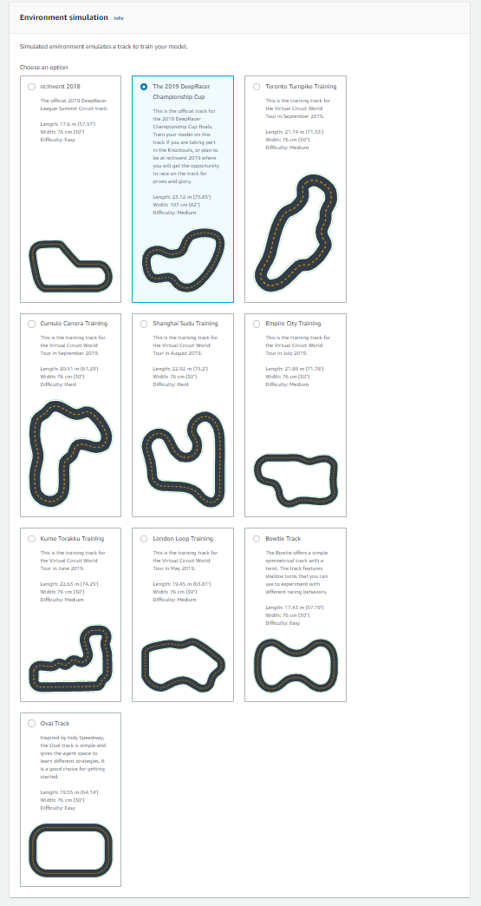

Scroll down and select **Next**.

### 4.2 Race type, and agent



#### 4.2.1 Race type

On this screen you can select your racing type. As mentioned in the Notes above in this lab we will focus on training a time-trial model so you can go race in the MGM Grand Garden.

Please select **Time-trial**.

#### 4.2.2 Agent

Please choose the vehicle you want to train with. Note by selecting the vehicle you implicitly select the sensor configuration, action space, and neural network topology associated with that vehicle. For today's lab we recommend selecting a vehicle with max speed of 1m/s if you don't want to tweak hyperparameters in the next screen. If you do select a vehicle with a high maximum speed, be prepared for a longer training time and also to tweak your hyperparameters.

**Important to note** that once you have started training a model using a particular agent (car), the settings of the agent remains with the model, even if you go and change the agent in the Garage. Thus changes to your agents will not affect your existing models, but will only affect future models that you start training. We will call this out again later.

Scroll down and select **Next**.

### 4.3 Reward function, training algorithm and hyperparameters, and stop conditions

#### 4.3.1 Reward function

In reinforcement learning, the reward function plays a **critical** role in training your models. The reward function provides the logic that tells your agent how good or bad an outcome was by assigning a value to it. These rewards are used in the training algorithm, which optimizes the model to choose actions that lead to the maximum expected cumulative rewards. The reward function is used during training to incentivize the driving behavior you want the agent to exhibit when you ultimately stop training the model and race it. 

In practice the reward is calculated during each step in training. That is after each action is taken a reward is calculated based on the outcome. Each step is recorded (state, action, next state, reward) and used to train the model. 

You can build the reward function logic using a number of variables that are exposed by the simulator in a Python dictionary called params. These variables represent measurements of the car, such as steering angle and speed, the car in relation to the racetrack, such as (x, Y) coordinates, and the racetrack, such as waypoints. You can use these measurements to build your reward function logic in Python 3 syntax.

The following list contains the variables you can use in your reward function. Note these are updated from time to time as our engineers and scientists find better ways of doing things, so adjust your previous reward functions accordingly. Always use the latest descriptions in the AWS DeepRacer service. Note, if you use the SageMaker RL notebook, you will have to look at the syntax used in the notebook itself.

		{
			"all_wheels_on_track": Boolean,        # flag to indicate if the agent is on the track
			"x": float,                            # agent's x-coordinate in meters
			"y": float,                            # agent's y-coordinate in meters
			"closest_objects": [int, int],         # zero-based indices of the two closest objects to the agent's current position of (x, y).
			"closest_waypoints": [int, int],       # indices of the two nearest waypoints.
			"distance_from_center": float,         # distance in meters from the track center 
			"is_crashed": Boolean,                 # Boolean flag to indicate whether the agent has crashed.
			"is_left_of_center": Boolean,          # Flag to indicate if the agent is on the left side to the track center or not. 
			"is_offtrack": Boolean,                # Boolean flag to indicate whether the agent has gone off track.
			"is_reversed": Boolean,                # flag to indicate if the agent is driving clockwise (True) or counter clockwise (False).
			"is_terminated": Boolean,              # Boolean flag to indicate whether the episode has ended.
			"heading": float,                      # agent's yaw in degrees
			"objects_distance": [float, ],         # list of the objects' distances in meters between 0 and track_len.
			"objects_heading": [float, ],          # list of the objects' headings in degrees between -180 and 180.
			"objects_left_of_center": [Boolean, ], # list of Boolean flags indicating whether elements' objects are left of the center (True) or not (False).
			"objects_location": [(float, float),], # list of of object locations [(x,y), ...].
			"objects_speed": [float, ],            # list of the objects' speeds in meters per second.
			"progress": float,                     # percentage of track completed
			"speed": float,                        # agent's speed in meters per second (m/s)
			"steering": float,                     # agent's steering angle in degrees
			"steps": int,                          # number steps completed
			"track_length": float,                 # track length in meters.
			"track_width": float,                  # width of the track
			"waypoints": [(float, float), ]        # list of (x,y) as milestones along the track center

		}

Here is a visual explanation of some of the reward function parameters.



Here is a visualization of the waypoints used for the 2019 Championship Cup track. You will only have access to the centerline waypoints in your reward function. Note also that you can recreate this graph by just printing the list of waypoints in your reward function and then plotting them. When you use a print function in your reward function, the output will be placed in the AWS RoboMaker logs. You can do this for any track you can train on. We will discuss logs later.

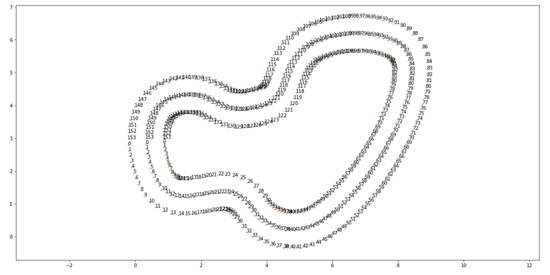

A useful method to come up with a reward function, is to think about the behavior you think a car that drives well will exhibit. A simple example would be to reward the car for staying on the road. This can be done by setting reward = 1, always. This will work in our simulator, because when the car goes off the track we reset it, and the car starts on the track again so we don't have to fear rewarding behavior that leads off the track. However, this is probably not the best reward function, because it completely ignores all other variables that can be used to craft a good reward function.

Below we provide a few reward function examples that are sufficient for time-trial racing. 

**Example 1**: Basic reward function that promotes centerline following.
Here we first create three bands around the track, using the three markers, and then proceed to reward the car more for driving in the narrow band as opposed to the medium or the wide band. Also note the differences in the size of the reward. We provide a reward of 1 for staying in the narrow band, 0.5 for staying in the medium band, and 0.1 for staying in the wide band. If we decrease the reward for the narrow band, or increase the reward for the medium band, we are essentially incentivizing the car to be use a larger portion of the track surface. This could come in handy, especially when there are sharp corners.


	def reward_function(params):
		'''
		Example of rewarding the agent to follow center line
		'''
		
		# Calculate 3 marks that are farther and father away from the center line
		marker_1 = 0.1 * params['track_width']
		marker_2 = 0.25 * params['track_width']
		marker_3 = 0.5 * params['track_width']
		
		# Give higher reward if the car is closer to center line and vice versa
		if params['distance_from_center'] <= marker_1:
			reward = 1.0
		elif params['distance_from_center'] <= marker_2:
			reward = 0.5
		elif params['distance_from_center'] <= marker_3:
			reward = 0.1
		else:
			reward = 1e-3  # likely crashed/ close to off track
		
		return float(reward)

Hint: Don't provide rewards equal to zero. The specific optimizer that we are using struggles when the reward given is zero. As such we initialize the reward with a small value. 

**Example 2**: Advanced reward function that penalizes excessive steering and promotes centerline following.


	def reward_function(params):
		'''
		Example that penalizes steering, which helps mitigate zig-zag behaviors
		'''

		# Calculate 3 marks that are farther and father away from the center line
		marker_1 = 0.1 * params['track_width']
		marker_2 = 0.25 * params['track_width']
		marker_3 = 0.5 * params['track_width']

		# Give higher reward if the car is closer to center line and vice versa
		if params['distance_from_center'] <= marker_1:
			reward = 1
		elif params['distance_from_center'] <= marker_2:
			reward = 0.5
		elif params['distance_from_center'] <= marker_3:
			reward = 0.1
		else:
			reward = 1e-3  # likely crashed/ close to off track

		# Steering penality threshold, change the number based on your action space setting
		ABS_STEERING_THRESHOLD = 15

		# Penalize reward if the car is steering too much
		if abs(params['steering_angle']) > ABS_STEERING_THRESHOLD:  # Only need the absolute steering angle
			reward *= 0.5

		return float(reward)
		

**Example 3**: Advanced reward function that penalizes going slow and promotes centerline following.


	def reward_function(params):
		'''
		Example that penalizes slow driving. This create a non-linear reward function so it may take longer to learn.
		'''

		# Calculate 3 marks that are farther and father away from the center line
		marker_1 = 0.1 * params['track_width']
		marker_2 = 0.25 * params['track_width']
		marker_3 = 0.5 * params['track_width']

		# Give higher reward if the car is closer to center line and vice versa
		if params['distance_from_center'] <= marker_1:
			reward = 1
		elif params['distance_from_center'] <= marker_2:
			reward = 0.5
		elif params['distance_from_center'] <= marker_3:
			reward = 0.1
		else:
			reward = 1e-3  # likely crashed/ close to off track

		# penalize reward for the car taking slow actions
		# speed is in m/s
		# we penalize any speed less than 0.5m/s
		SPEED_THRESHOLD = 0.5
		if params['speed'] < SPEED_THRESHOLD:
			reward *= 0.5

		return float(reward)

Using the above examples you can now proceed to craft your own reward function. Here are a few other tips:

- You can use the waypoints to calculate the direction from one waypoint to the next.
- You can use the right-hand rule from 2D gaming to determine on which side of the track you are on.
- You can scale rewards exponentially, just cap them at 10,000.
- Keep your action space in mind when using speed and steering_angle in your reward function.
- To keep track of episodes in the logs where your car manages to complete a lap, consider giving a finish bonus (aka reward += 10000) where progress = 100. This is because once the car completes a lap progress will not go beyond 100, but the simulation will continue. The model will keep on training until it reaches the stopping time, but that does not imply the final model is the best model, especially when it comes to racing in the real world. This is a temporary workaround as we will solve.

Once you are done creating your reward function be sure to use the **Validate** button to verify that your code syntax is good before training begins. When you start training this reward function will be stored in a file in your S3, but also make sure you copy and store it somewhere to ensure it is safe.

Scroll down and select **Next**.

For those interested in head-to-head racing, here is a basic reward function

**Example 4**: Basic head-to-head reward function


		""" We consider both the  
		distance between the learner car and the closest bot car,  
		as well as if the learner car is within the wedge area 
		apexed at the bot car. The assumption is within the wedge
		is more possible to crash. """

		def reward_function(params):
			
			reward = 1e-3

			distance_from_center = params['distance_from_center']
			track_width = params['track_width']
			bot_car_progress_delta = params['bot_car_progress']
			bot_car_lane_match = params['bot_car_lane_match']
			speed = params['speed']
			steering = abs(params['steering_angle'])
			flag_unsafe = params['flag_unsafe']
			dist_closest_bot_car = params['dist_closest_bot']
			is_bot_in_camera = params['is_bot_in_camera']
			
			reward = 1e-3  # likely crashed / close to off track        
			if distance_from_center <= (0.3 * track_width): 
				reward_lane = 1.0
				if distance_from_center <= (0.2 * track_width):
					# geting close to the center
					reward_lane *= 0.8
				elif distance_from_center <= (0.1 * track_width):
					# getting closer
					reward_lane *= 0.2
				elif distance_from_center <= (0.05 * track_width):
					# too close
					reward_lane = 1e-3       
			else:
				reward_lane = 1e-3
				
			# avoid closest bot car
			reward_avoid = 1.0
			# penalize if distance too close
			if 0.8 <= dist_closest_bot_car < 1.0:
				reward_avoid *= 0.8
			elif 0.5 <= dist_closest_bot_car < 0.8:
				reward_avoid *= 0.5
			elif 0.3 < dist_closest_bot_car < 0.5:
				reward_avoid *= 0.01
				
			
			# on the different lane of the closest ahead bot car
			if bot_car_lane_match and is_bot_in_camera:
				reward = 0.0
			else:
				reward = 2.0*reward_avoid + 2.0*reward_lane
				
								  
			# speed penalty
			if speed < 3.0:
				reward *= 0.5
				

			return float(reward)

#### 4.3.2 Training algorithm and hyperparameters




##### 4.3.2.1 Training algorithm


For the time being you can only use the PPO (Proximal Policy Optimization) algorithm in the console.

##### 4.3.2.2 Hyperparameters (formerly called algorithm settings)


This section specifies the hyperparameters that will be used by the reinforcement learning algorithm during training. Hyperparameters are used to improve training performance.

Before we dive in, let's just call out some terms we will be using to ensure you are familiar with what they mean.

A **step**, also known as experience, is a tuple of (s,a,r,s’), where s stands for an observation (or state) captured by the sensors, a for an action taken by the vehicle, r for the expected reward incurred by the said action, and s’ for the new observation (or new state) after the action is taken.

An **episode** is a period in which the vehicle starts from a given starting point and ends up completing the track or going off the track. Thus an episode is a sequence of steps, or experience. Different episodes can have different lengths.

A **training iteration** represents one iteration where the agent uses the current version of the model to go and collect more experience in the form of episodes (containing steps). After a specified number of episodes is collected the episodes are used to train (and hopefully improve) the model. Once training for this iteration is done, the next iteration begins, and uses the trained model in the next training iteration.

An **experience buffer** consists of a number of ordered steps collected over fixed number of episodes of varying lengths during training. It serves as the source from which input is drawn for updating the underlying (policy and value) neural networks.

A **batch** is an ordered list of experiences, representing a portion of the experience obtained in the simulation over a period of time, and it is used to update the policy network weights.

A set of batches sampled at random from an experience buffer is called a **training data set**, and used for training the policy network weights.

The default parameters work well for time-trial models where the max speed is less than 1m/s. However, consider changing them as you start iterating on your models as they can significantly improve training convergence.

| Parameter                                | Description                                                                                                                                                                                                                                                                                                                                                                                                                                                                                                                                                                      |
|------------------------------------------|----------------------------------------------------------------------------------------------------------------------------------------------------------------------------------------------------------------------------------------------------------------------------------------------------------------------------------------------------------------------------------------------------------------------------------------------------------------------------------------------------------------------------------------------------------------------------------|
| Batch size                               | The number recent of vehicle experiences sampled at random from an experience buffer and used for updating the underlying deep-learning neural network weights.   If you have 5120 experiences in the buffer, and specify a batch size of 512, then ignoring random sampling, you will get 10 batches of experience. Each batch will be used, in turn, to update your neural network weights during training.  Use a larger batch size to promote more stable and smooth updates to the neural network weights, but be aware of the possibility that the training may be slower. |
| Number of epochs                         |  An epoch represents one pass through all batches, where the neural network weights are updated after each batch is processed, before proceeding to the next batch.   10 epochs implies you will update the neural network weights, using all batches one at a time, but repeat this process 10 times.  Use a larger number of epochs to promote more stable updates, but expect slower training. When the batch size is small,you can use a smaller number of epochs.                                                                                                           |
| Learning rate                            |  The learning rate controls how big the updates to the neural network weights are. Simply put, when you need to change the weights of your policy to get to the maximum cumulative reward, how much should you shift your policy.  A larger learning rate will lead to faster training, but it may struggle to converge. Smaller learning rates lead to stable convergence, but can take a long time to train.                                                                                                                                                                   |
| Exploration                              |  This refers to the method used to determine the trade-off between exploration and exploitation. In other words, what method should we use to determine when we should stop exploring (randomly choosing actions) and when should we exploit the experience we have built up.  Since we will be using a discrete action space, you should always select CategoricalParameters.                                                                                                                                                                                                   |
| Entropy                                  | A degree of uncertainty, or randomness, added to the probability distribution of the action space. This helps promote the selection of random actions to explore the state/action space more broadly.                                                                                                                                                                                                                                                                                                                                                                            |
| Discount factor                          | A factor that specifies how much the future rewards contribute to the expected cumulative reward. The larger the discount factor, the farther out the model looks to determine expected cumulative reward and the slower the training. With a discount factor of 0.9, the vehicle includes rewards from an order of 10 future steps to make a move. With a discount factor of 0.999, the vehicle considers rewards from an order of 1000 future steps to make a move. The recommended discount factor values are 0.99, 0.999 and 0.9999.                                         |
| Loss type                                | The loss type specified the type of the objective function (cost function) used to update the network weights. The Huber and Mean squared error loss types behave similarly for small updates. But as the updates become larger, the Huber loss takes smaller increments compared to the Mean squared error loss. When you have convergence problems, use the Huber loss type. When convergence is good and you want to train faster, use the Mean squared error loss type.                                                                                                      |
| Number of episodes between each training |  This parameter controls how much experience the car should obtain between each model training iteration. For more complex problems which have more local maxima, a larger experience buffer is necessary to provide more uncorrelated data points. In this case, training will be slower but more stable. The recommended values are 10, 20 and 40.                           |

#### Observations: playing with max speed and hyperparameters to get convergence

The faster you set the maximum speed, the longer your model will take to train. Furthermore, in some high speed models you may have to start tweaking your hyperparameters in order to get to convergence. The following charts shows you the average track progress (solid line) and per episode track progress (dots) made across as measured in episodes, across various training jobs. The idea is that you want the progress your car makes to increase over time, which shows that the model is improving. If progress doesn't improve over time (flat lines) consider changing your reward function, action space, and/or hyperparameters.




The takeaway here is that when you use a larger learning rate (0.001) vs the default (0.0003), your model will train faster, as the updates to the neural network weights (those weights that are changed as we try to optimize the policy to get maximum expected cumulative reward) are larger. However, based on the above (very simplistic experiments) it seems that you have to train in smaller batch sizes to make better use of the larger learning rate.


Note that after each training iteration we will save the new model file to your S3 bucket. The AWS DeepRacer service will not show all models trained during a training run, just the last model. We will look at these in Section 3.

#### 4.3.3 Stop conditions

This is the last section before you start training. Here you can specify the maximum time your model will train for. Ideally you should put a number in this condition. You can always stop training early. Furthermore, if your model stopped as a result of the condition, you can go to the model list screen, and clone your model to restart training using new parameters.

Please specify at least 120 minutes, if you selected the basic suggestions, and then select **Create model**. If there is an error, you will be taken to the error location. Note the Python syntax will also be validated again. Once you start training it can take up to 6 minutes to spin up the services needed to start training. During this time let's talk through the AWS DeepRacer League and how you can take part.

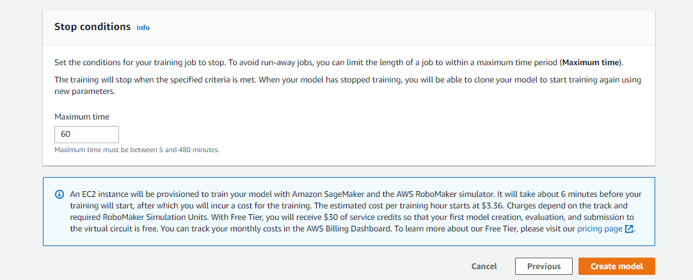

Note 25 to 35 minutes of lab time should have elapsed by this point.

**Important to note** that once you have started training a model using a particular agent (car), the settings of the agent remains with the model, even if you go and change the agent in the Garage. Thus changes to your agents will not affect your existing models, but will only affect future models that you start training.

# Section 2: Competing in the AWS DeepRacer League

## 2.1 2019 AWS DeepRacer League
The [AWS DeepRacer League](https://aws.amazon.com/deepracer/league/) is the world's first global autonomous racing league. The 2019 League is concluding right here at reInvent 2019, and you can **watch the finalists race in the MGM Grand Garden** to see who make it through to the final. The **final will take place in the at 8am in the Venetian before the Keynote**.


## 2.2 2020 AWS DeepRacer League

The League will be back in 2020, so start training your models and taking part in the pre-season virtual races listed under **[Official DeepRacer virtual circuit](https://console.aws.amazon.com/deepracer/home?region=us-east-1#leaderboards)** in the console. In 2020 you can look forward to more in-person races at selected AWS Summits, and more virtual races in the AWS DeepRacer service in the AWS console. We will also introduce two new race formats, object avoidance, and head-to-head racing, in addition to the 2019 time-trial format.

Once you have a trained model, you can  submit it to any open warm-up race in the [console](https://console.aws.amazon.com/deepracer/home?region=us-east-1#leaderboards). Your model will then be evaluated by the AWS DeepRacer service on the indicated competition track. After your model has been evaluated you will see your standing update if your lap time was better than your prior submission.

# Section 3: Model training and improving your model

## 3.1: While your model is training

After you have clicked create model in section 1 step 4, your model will start training and you should see the following:



Once your model has trained for a while you should see the following:
- **Reward graph** on the left. The reward graph plots the average reward per training iteration, and the average progress per training iteration by default. We look at the average for the training iteration as the average shows the quality of the model, not the individual episode. However you can also look at these values per episode using the toggles.
- **Simulation video stream** on the right. This shows the video stream from the simulator, providing a third person view of your car as it is learning, and also a useful picture-in-picture aerial view of the map.

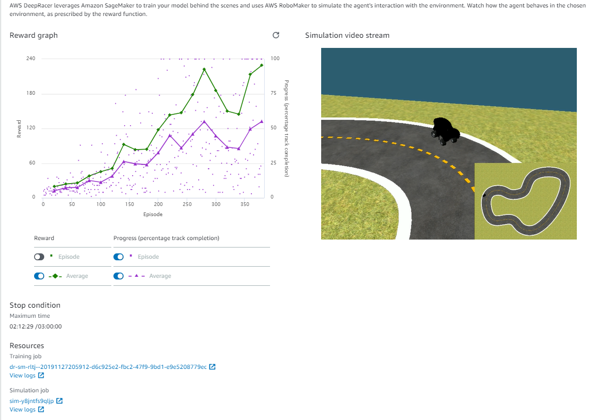

The stop condition timer shows how much time has passed since you started training.

At first your car will not be able to drive on a straight road but as it learns better driving behavior you should see its performance improving, and the reward graph increasing. Furthermore, when you car drives off of the track it will be reset on the track. Don't be alarmed if your car doesn't start at the same position. We have enabled round robin to allow the car to start at subsequent points on the track each time to ensure it can train on experience from the whole track. Lastly, if you see your car aimlessly drive off track and not resetting, this is when the experience obtained is sent back to Amazon SageMaker to train the model. Once the model has been updated, the new model will be sent back to AWS RoboMaker and the car will resume.


Scrolling down some more you will see the training configuration used for this model



You also have direct links to the Amazon SageMaker job and its logs that is running, as well as to the AWS RoboMaker job and logs that is currently running. These are super valuable when you dive into the log-analysis notebook also on GitHub. AWS RoboMaker logs will contain output from the simulator, and the Amazon SageMaker logs will contain output from the model training. If there are any errors, the logs are a good place to start.

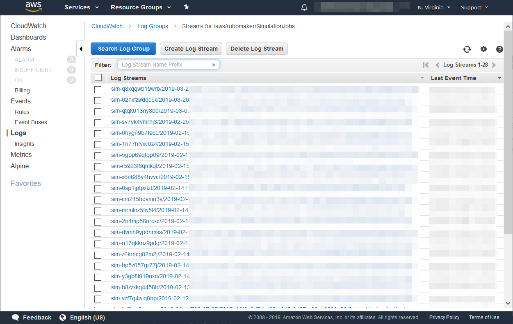

The AWS DeepRacer service makes use of Amazon SageMaker, AWS RoboMaker, Amazon S3, Amazon Kinesis Video Streams, AWS Lambda, and Amazon CloudWatch. You can navigate to each of these services to get an update on the service's status or for other useful information.

In each service you will see a list of current and prior jobs, where retained. Here is a view of training jobs executed in Amazon SageMaker.

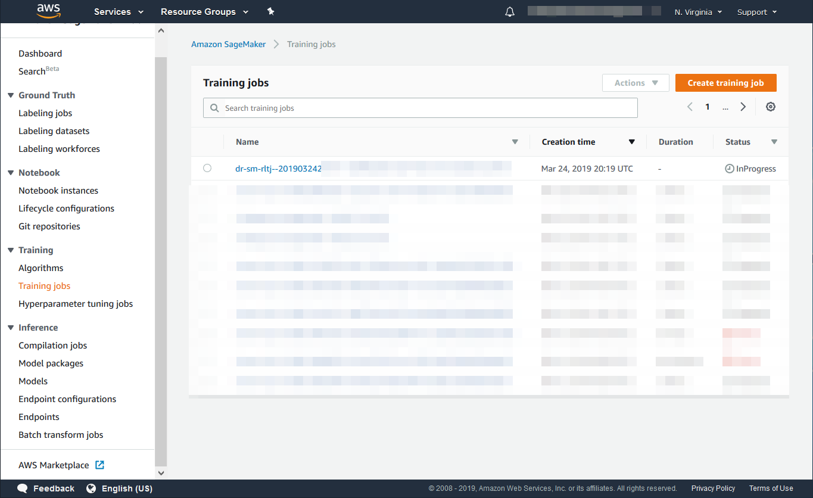

In Amazon SageMaker you will be able to see the logs as well as utilization of the EC2 instance spun up to run training.



In AWS RoboMaker you can see the list of all simulation jobs, and for active jobs you can get a direct view into the simulation environment.



You can select your active simulation job from the list and then select the Gazebo icon. 

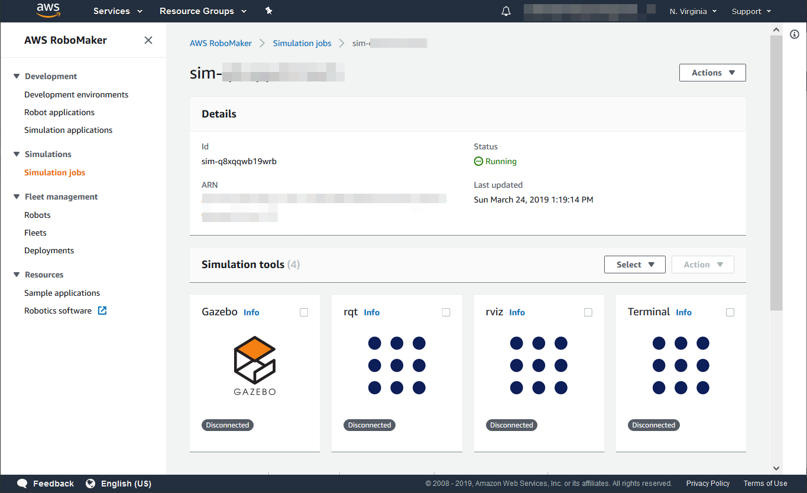

This will open a new window showing you the simulation environment. **Take care in this environment because any changes you make to it will affect your simulation in real time. Thus if you accidentally drag or rotate the vehicle or the environment, it may negatively affect your training job.**

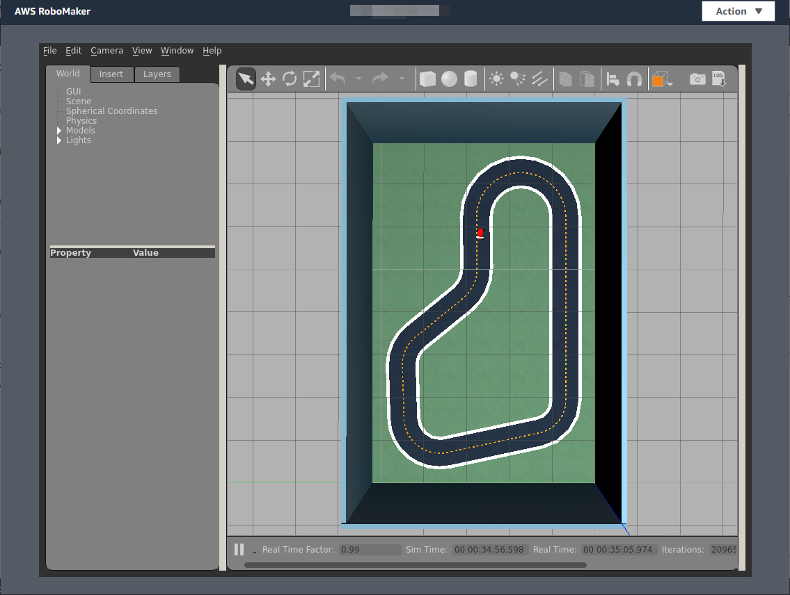 

The Amazon Kinesis Video Stream is typically deleted after use to free up space and due to limits on the number of streams. Note also that at present the video is not yet stored in your S3 account, for both training and evaluations.

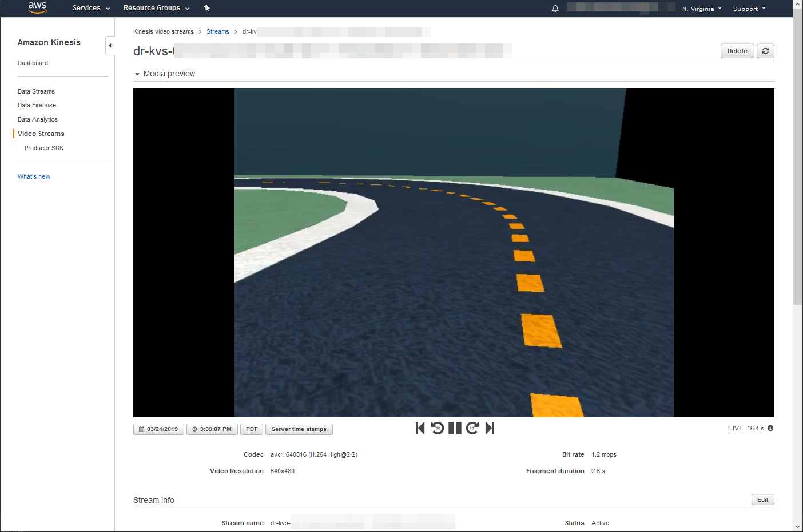

Amazon S3 will store the final model, that is referenced in the AWS DeepRacer service, and interim models trained during your training jobs in the aws-deepracer bucket. Your reward functions will also be stored in the same bucket.



The final model is stored as model.tar.gz file in a folder called DeepRacer-SageMaker-rlmdl-account number-date in your DeepRacer S3 bucket.  
The interim models are stored as .pd files in a folder called DeepRacer-SageMaker-RoboMaker-comm-account number-date
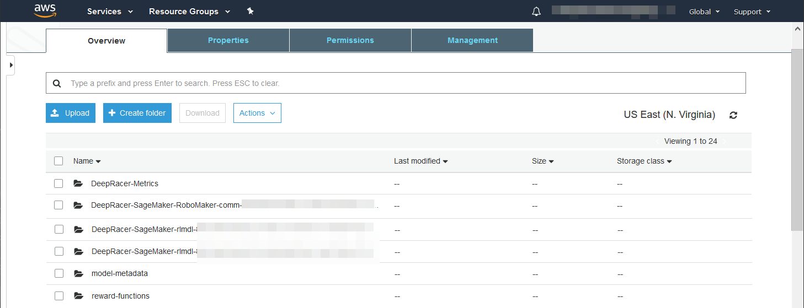

The AWS DeepRacer service can at the time of writing only reference one final model for each training job. However, should you want to swap out the model trained during the final training iteration, with any model trained in the training iterations running up to the final, you can simple swap out the model.pb file in the final model.tar.gz file. Note that you should not change the other files in the .tar.gz as this may render the model useless. Do this after your model has stopped training, or after you manually stopped training.

## 3.2: Evaluating the performance of your model

You may not have time in the workshop to do from step 2 onwards. Once your model training is complete you can start model evaluation. From your model details page, where you observed training, select **Start evaluation**. You can now select the track on which you want to evaluate the performance of your model and also the number of laps. Select the re:Invent 2018 track and 5 laps and select Start. 

Once done you should see something as follows.



## 3.3: Race in the AWS DeepRacer League

If you are happy with your model you can go race in the [Summit Circuit](https://aws.amazon.com/deepracer/summit-circuit/) or in the [Virtual Circuit](https://console.aws.amazon.com/deepracer/home?region=us-east-1#leaderboards). You can submit your trained model into the Virtual Circuit's current open race [here](https://console.aws.amazon.com/deepracer/home?region=us-east-1#leaderboards).

## 3.4: Create and host your own Virtual Race

Navigate to [Community races](https://console.aws.amazon.com/deepracer/home?region=us-east-1#/races) in the console and **create your own virtual race**.

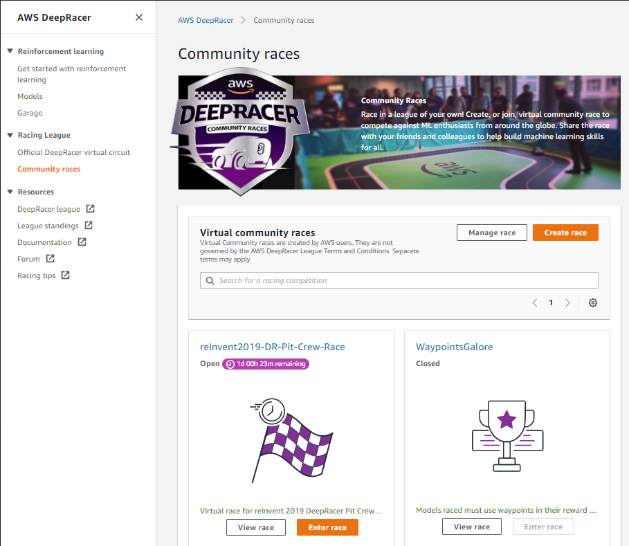

You can share the code with your friends and colleagues and create a league of your own!

## 3.5: Iterating and improving your model

Based on the evaluation of the model you should have a good idea as to whether your model can complete the track reliably, and what the average lap time is. Note that for the Virtual Circuit races you will have to complete a certain number of laps consecutively with your model, and so focus on building a reliable model. The number of laps will be determined race by race.

At this point you have to experiment and iterate on your reward function and hyperparameters. It is best to try a few different reward functions based on different driving behavior, and then evaluate them in the simulator to select the best performing one. If you have an AWS DeepRacer you can also test them in the real world.

Hints:
- Increase training time beyond. If your model can't reliably complete a lap try to extend your model training time.
- Try modifying action space by increasing max speed to get faster lap times.
- Tweak your reward function to incentivize your car to drive faster : you’ll want to specifically modify progress, steps and speed variables.
- Clone your model to leverage training experience. Please note that you will not be able to change action space once a model is cloned, otherwise the job will fail.

## 3.6: Analyze model performance by inspecting the RoboMaker logs
If you do want to go a step further, you can evaluate the performance of each model that was trained during the training job by inspecting the log file.

To download the log file from CloudWatch you can use the following code with [Amazon CLI](https://docs.aws.amazon.com/polly/latest/dg/setup-aws-cli.html).  

**Download the RoboMaker log from CloudWatch**

1. [Quick Analysis] Get last 10000 lines from the log

	aws logs get-log-events --log-group-name  "/aws/robomaker/SimulationJobs"  --log-stream-name  "<STREAM_NAME>" --output text --region us-east-1 > deepracer-sim.log

2. [Export Entire Log] Copy the log from Amazon Cloudwatch to Amazon S3. Follow the link to export all the logs to [Amazon S3](https://docs.aws.amazon.com/AmazonCloudWatch/latest/logs/S3ExportTasks.html)

You can now analyze the log file using Python Pandas and see which model iterations provided the highest total reward. Furthermore, if you did add a finish bonus, you can see which model iterations were able to finish a lap. These models are good candidates to test in the simulator and in the real world.

## 3.7: Join the AWS DeepRacer Slack Community

Join the **[AWS DeepRacer Slack Community](https://deepracer-community.slack.com/)** where community members are discussing everything DeepRacer.



